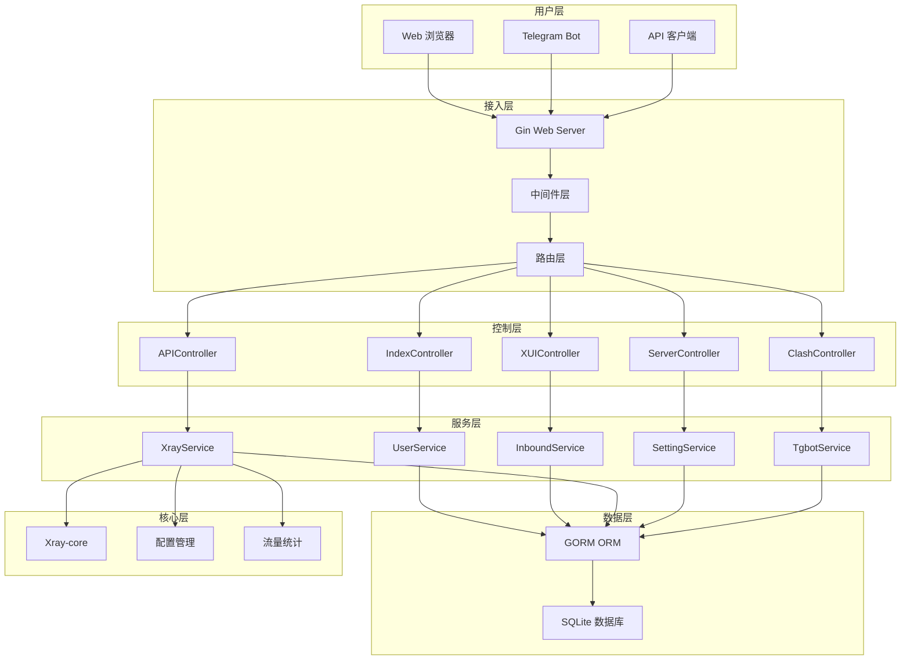
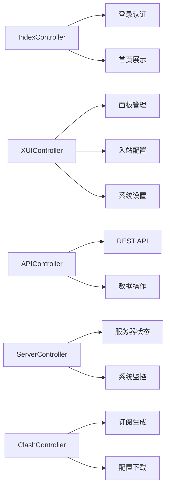
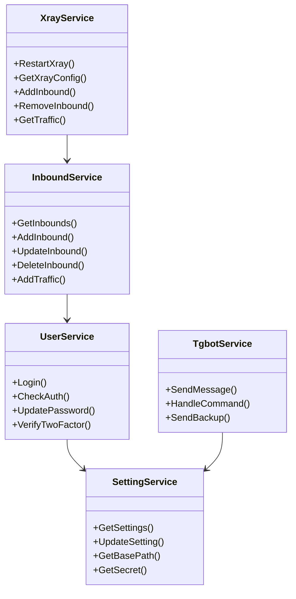
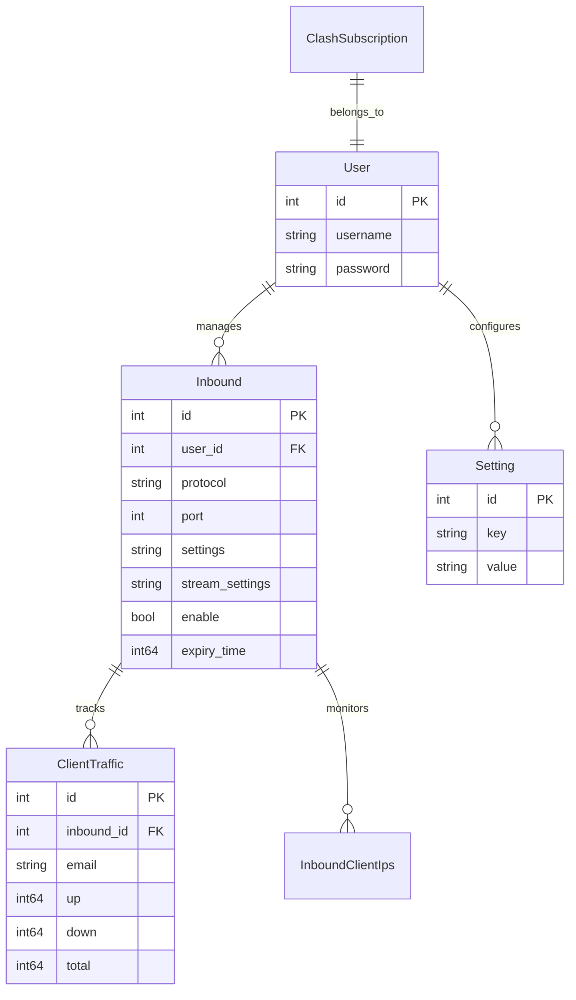
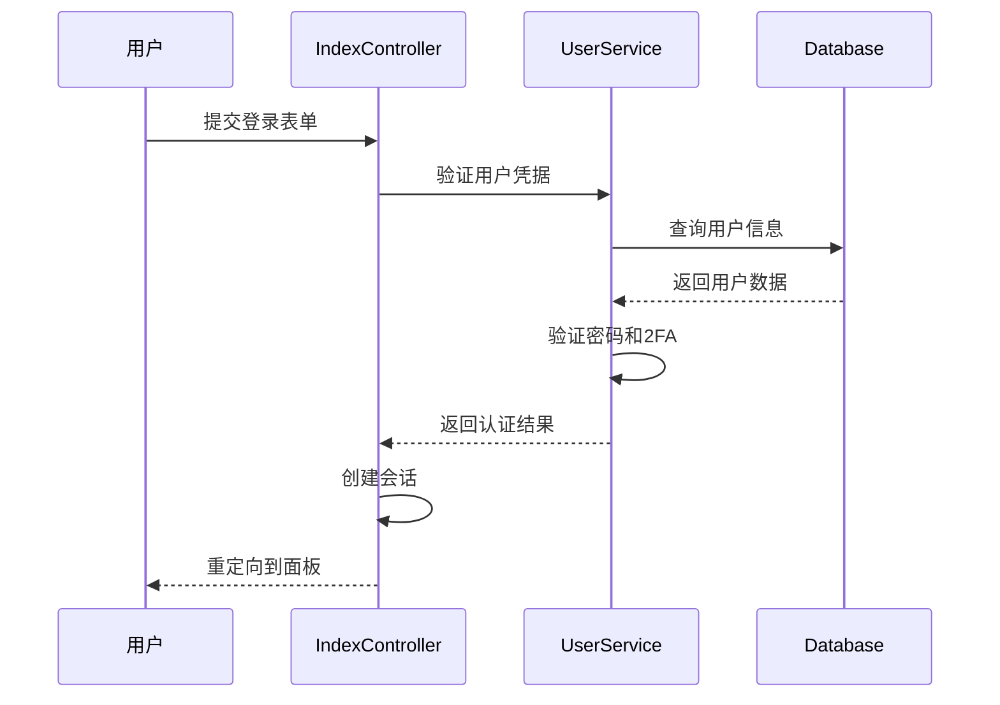
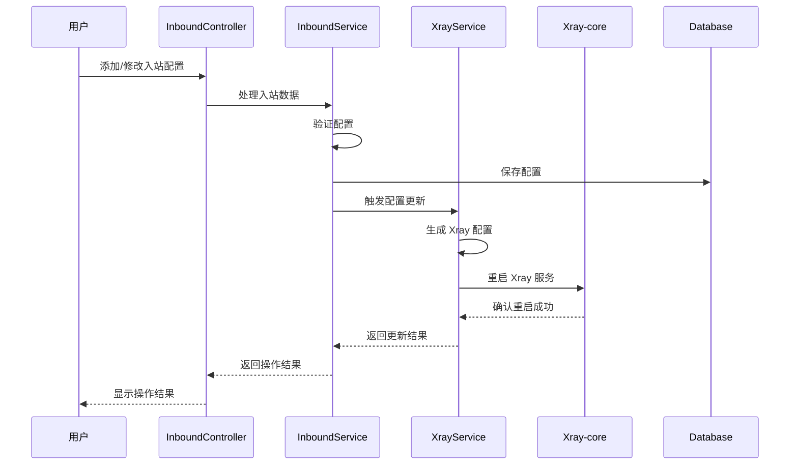
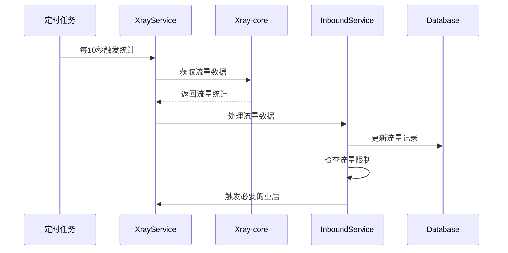

# 3x-ui 系统架构

## 🏗️ 整体架构

3x-ui 采用分层架构设计，确保系统的可维护性、可扩展性和高性能。



## 📦 核心模块

### 1. Web 服务器层 (web/)

#### 主要组件
- **web.go**: Web 服务器核心，负责启动和配置
- **路由管理**: 基于 Gin 的路由系统
- **中间件**: 认证、日志、CORS 等中间件
- **静态资源**: 嵌入式文件系统

#### 关键特性
```go
type Server struct {
    httpServer *http.Server
    listener   net.Listener
    
    // 控制器
    index  *controller.IndexController
    server *controller.ServerController
    panel  *controller.XUIController
    api    *controller.APIController
    clash  *controller.ClashController
    
    // 服务
    xrayService    service.XrayService
    settingService service.SettingService
    tgbotService   service.Tgbot
    
    // 任务调度
    cron *cron.Cron
}
```

### 2. 控制器层 (web/controller/)

#### 控制器职责分工



### 3. 服务层 (web/service/)

#### 核心服务架构



### 4. 数据层 (database/)

#### 数据模型关系



## 🔄 核心流程

### 1. 用户认证流程



### 2. Xray 配置更新流程



### 3. 流量统计流程



## 🔧 技术架构特点

### 1. 分层设计
- **表现层**: Web UI + REST API
- **业务层**: 服务组件 + 业务逻辑
- **数据层**: ORM + 数据库
- **集成层**: Xray-core + 外部服务

### 2. 依赖注入
- 控制器依赖服务层
- 服务层依赖数据层
- 松耦合设计便于测试

### 3. 中间件架构
- 认证中间件
- 日志中间件
- 错误处理中间件
- 域名验证中间件

### 4. 任务调度
- Cron 定时任务
- Xray 状态检查
- 流量统计收集
- 自动重启机制

## 📊 性能优化

### 1. 数据库优化
- 连接池管理
- 索引优化
- 事务控制
- 批量操作

### 2. 内存管理
- 对象池复用
- 缓存策略
- 垃圾回收优化

### 3. 网络优化
- HTTP/2 支持
- Gzip 压缩
- 静态资源缓存
- 连接复用

## 🔒 安全架构

### 1. 认证安全
- Session 管理
- 双因子认证
- 密码加密存储
- 登录失败限制

### 2. 数据安全
- 敏感数据加密
- SQL 注入防护
- XSS 防护
- CSRF 保护

### 3. 网络安全
- HTTPS 强制
- 域名验证
- IP 白名单
- 访问控制

---

*下一步: 查看 [数据库设计](./03-database-design.md) 了解详细的数据模型*
