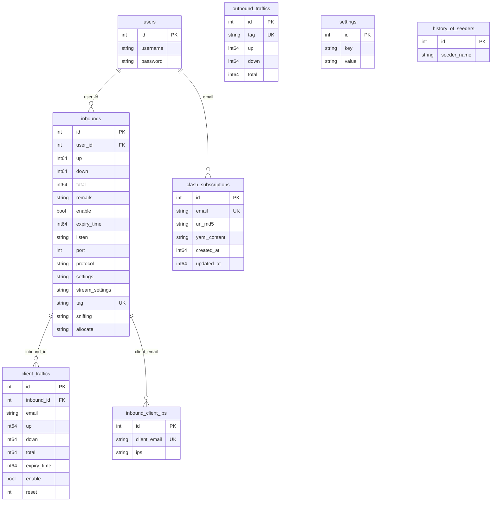

# 3x-ui 数据库设计

## 📊 数据库概览

3x-ui 使用 **SQLite** 作为数据库，通过 **GORM** ORM 进行数据访问。数据库设计采用关系型模型，支持自动迁移和数据完整性约束。

### 技术栈
- **数据库**: SQLite 3
- **ORM**: GORM v1.30.0
- **驱动**: gorm.io/driver/sqlite v1.6.0
- **特性**: 自动迁移、事务支持、连接池

## 🗃️ 数据表结构

### 1. 用户表 (users)

```sql
CREATE TABLE users (
    id INTEGER PRIMARY KEY AUTOINCREMENT,
    username TEXT NOT NULL,
    password TEXT NOT NULL
);
```

**字段说明**:
- `id`: 主键，自增
- `username`: 用户名
- `password`: 密码（bcrypt 加密）

**GORM 模型**:
```go
type User struct {
    Id       int    `json:"id" gorm:"primaryKey;autoIncrement"`
    Username string `json:"username"`
    Password string `json:"password"`
}
```

### 2. 入站配置表 (inbounds)

```sql
CREATE TABLE inbounds (
    id INTEGER PRIMARY KEY AUTOINCREMENT,
    user_id INTEGER NOT NULL,
    up INTEGER DEFAULT 0,
    down INTEGER DEFAULT 0,
    total INTEGER DEFAULT 0,
    remark TEXT,
    enable BOOLEAN DEFAULT true,
    expiry_time INTEGER,
    listen TEXT,
    port INTEGER NOT NULL,
    protocol TEXT NOT NULL,
    settings TEXT,
    stream_settings TEXT,
    tag TEXT UNIQUE,
    sniffing TEXT,
    allocate TEXT
);
```

**字段说明**:
- `id`: 主键，自增
- `user_id`: 关联用户ID
- `up/down/total`: 流量统计（字节）
- `remark`: 备注名称
- `enable`: 是否启用
- `expiry_time`: 过期时间（Unix时间戳）
- `listen`: 监听地址
- `port`: 监听端口
- `protocol`: 协议类型（vmess/vless/trojan等）
- `settings`: 协议配置（JSON）
- `stream_settings`: 传输配置（JSON）
- `tag`: 唯一标识
- `sniffing`: 流量探测配置
- `allocate`: 端口分配配置

**支持的协议**:
```go
const (
    VMESS       Protocol = "vmess"
    VLESS       Protocol = "vless"
    DOKODEMO    Protocol = "dokodemo-door"
    HTTP        Protocol = "http"
    Trojan      Protocol = "trojan"
    Shadowsocks Protocol = "shadowsocks"
    Socks       Protocol = "socks"
    WireGuard   Protocol = "wireguard"
)
```

### 3. 客户端流量表 (client_traffics)

```sql
CREATE TABLE client_traffics (
    id INTEGER PRIMARY KEY AUTOINCREMENT,
    inbound_id INTEGER NOT NULL,
    email TEXT NOT NULL,
    up INTEGER DEFAULT 0,
    down INTEGER DEFAULT 0,
    total INTEGER DEFAULT 0,
    expiry_time INTEGER,
    enable BOOLEAN DEFAULT true,
    reset INTEGER DEFAULT 0,
    FOREIGN KEY (inbound_id) REFERENCES inbounds(id)
);
```

**字段说明**:
- `inbound_id`: 关联入站配置ID
- `email`: 客户端邮箱（唯一标识）
- `up/down/total`: 流量统计
- `expiry_time`: 过期时间
- `enable`: 是否启用
- `reset`: 重置计数

### 4. 出站流量表 (outbound_traffics)

```sql
CREATE TABLE outbound_traffics (
    id INTEGER PRIMARY KEY AUTOINCREMENT,
    tag TEXT UNIQUE NOT NULL,
    up INTEGER DEFAULT 0,
    down INTEGER DEFAULT 0,
    total INTEGER DEFAULT 0
);
```

### 5. 客户端IP表 (inbound_client_ips)

```sql
CREATE TABLE inbound_client_ips (
    id INTEGER PRIMARY KEY AUTOINCREMENT,
    client_email TEXT UNIQUE NOT NULL,
    ips TEXT
);
```

**用途**: 记录客户端连接的IP地址，用于IP限制和监控。

### 6. 系统设置表 (settings)

```sql
CREATE TABLE settings (
    id INTEGER PRIMARY KEY AUTOINCREMENT,
    key TEXT NOT NULL,
    value TEXT
);
```

**核心配置项**:
- `secret`: 会话密钥
- `webPort`: Web端口
- `webBasePath`: 基础路径
- `tgBotToken`: Telegram Bot令牌
- `xrayTemplateConfig`: Xray配置模板

### 7. Clash订阅表 (clash_subscriptions)

```sql
CREATE TABLE clash_subscriptions (
    id INTEGER PRIMARY KEY AUTOINCREMENT,
    email TEXT UNIQUE NOT NULL,
    url_md5 TEXT NOT NULL,
    yaml_content TEXT,
    created_at INTEGER,
    updated_at INTEGER
);
```

### 8. 数据迁移历史表 (history_of_seeders)

```sql
CREATE TABLE history_of_seeders (
    id INTEGER PRIMARY KEY AUTOINCREMENT,
    seeder_name TEXT NOT NULL
);
```

## 🔗 数据关系图



## 🔧 数据库操作

### 1. 初始化流程

```go
func InitDB(dbPath string) error {
    // 1. 创建数据库目录
    dir := path.Dir(dbPath)
    os.MkdirAll(dir, fs.ModePerm)
    
    // 2. 配置GORM
    db, err = gorm.Open(sqlite.Open(dbPath), &gorm.Config{
        Logger: gormLogger,
    })
    
    // 3. 自动迁移表结构
    initModels()
    
    // 4. 初始化默认用户
    initUser()
    
    // 5. 初始化默认设置
    initDefaultSettings()
    
    // 6. 运行数据迁移
    runSeeders()
}
```

### 2. 自动迁移

```go
func initModels() error {
    models := []any{
        &model.User{},
        &model.Inbound{},
        &model.OutboundTraffics{},
        &model.Setting{},
        &model.InboundClientIps{},
        &xray.ClientTraffic{},
        &model.HistoryOfSeeders{},
        &model.ClashSubscription{},
    }
    for _, model := range models {
        db.AutoMigrate(model)
    }
}
```

### 3. 事务处理

```go
func (s *InboundService) AddTraffic(traffics []*xray.Traffic) error {
    db := database.GetDB()
    tx := db.Begin()
    
    defer func() {
        if err != nil {
            tx.Rollback()
        } else {
            tx.Commit()
        }
    }()
    
    // 批量更新流量数据
    for _, traffic := range traffics {
        tx.Model(&model.Inbound{}).
            Where("tag = ?", traffic.Tag).
            Updates(map[string]interface{}{
                "up":   gorm.Expr("up + ?", traffic.Up),
                "down": gorm.Expr("down + ?", traffic.Down),
            })
    }
    
    return nil
}
```

## 📈 性能优化

### 1. 索引策略
- **主键索引**: 所有表的 `id` 字段
- **唯一索引**: `inbounds.tag`, `client_traffics.email`
- **外键索引**: 自动创建关联字段索引

### 2. 查询优化
- **预加载**: 使用 `Preload` 减少N+1查询
- **批量操作**: 使用事务进行批量更新
- **分页查询**: 支持分页减少内存占用

### 3. 连接管理
```go
// 配置连接池
sqlDB, _ := db.DB()
sqlDB.SetMaxIdleConns(10)
sqlDB.SetMaxOpenConns(100)
sqlDB.SetConnMaxLifetime(time.Hour)
```

## 🔒 数据安全

### 1. 密码加密
```go
// 使用bcrypt加密密码
hashedPassword, err := crypto.HashPasswordAsBcrypt(password)
```

### 2. SQL注入防护
- 使用GORM参数化查询
- 避免字符串拼接SQL
- 输入验证和过滤

### 3. 数据备份
```go
func (s *ServerService) GetDb() ([]byte, error) {
    // 触发WAL检查点
    database.Checkpoint()
    
    // 读取数据库文件
    return os.ReadFile(config.GetDBPath())
}
```

## 🔄 数据迁移

### 1. 版本控制
通过 `history_of_seeders` 表记录已执行的迁移：

```go
func runSeeders(isUsersEmpty bool) error {
    var seedersHistory []string
    db.Model(&model.HistoryOfSeeders{}).Pluck("seeder_name", &seedersHistory)
    
    if !slices.Contains(seedersHistory, "UserPasswordHash") {
        // 执行密码哈希迁移
        migrateUserPasswords()
        
        // 记录迁移历史
        db.Create(&model.HistoryOfSeeders{
            SeederName: "UserPasswordHash",
        })
    }
}
```

### 2. 数据清理
```go
// 清理孤立的流量记录
func (s *InboundService) MigrationRemoveOrphanedTraffics() {
    db.Exec(`
        DELETE FROM client_traffics
        WHERE email NOT IN (
            SELECT JSON_EXTRACT(client.value, '$.email')
            FROM inbounds,
                JSON_EACH(JSON_EXTRACT(inbounds.settings, '$.clients')) AS client
        )
    `)
}
```

---

*下一步: 查看 [API接口文档](./04-api-documentation.md) 了解详细的接口设计*
