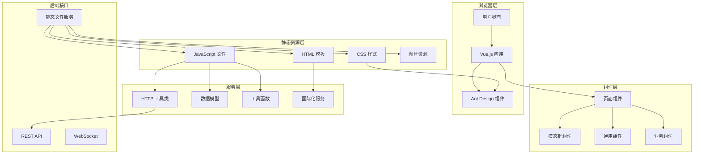

# 3x-ui 前端架构

## 🎨 前端技术栈

3x-ui 采用传统的服务端渲染架构，结合现代前端技术，提供响应式和用户友好的管理界面。

### 核心技术
- **模板引擎**: Go HTML Template
- **UI 框架**: Ant Design Vue 1.x
- **JavaScript 框架**: Vue.js 2.x
- **样式框架**: CSS3 + Ant Design 样式系统
- **图表库**: Chart.js / ECharts
- **代码编辑器**: CodeMirror
- **二维码**: QRious
- **国际化**: go-i18n + 前端多语言支持

## 🏗️ 前端架构设计



## 📁 前端文件结构

```
web/
├── html/                          # HTML 模板文件
│   ├── index.html                 # 主面板页面
│   ├── login.html                 # 登录页面
│   ├── inbounds.html              # 入站管理页面
│   ├── settings.html              # 系统设置页面
│   ├── xray.html                  # Xray 配置页面
│   ├── component/                 # 可复用组件
│   │   ├── aSidebar.html         # 侧边栏组件
│   │   ├── aThemeSwitch.html     # 主题切换组件
│   │   └── aTableSortable.html   # 可排序表格组件
│   ├── modals/                    # 模态框组件
│   │   ├── inboundModal.html     # 入站配置模态框
│   │   ├── clientsModal.html     # 客户端管理模态框
│   │   └── textModal.html        # 文本显示模态框
│   └── page/                      # 页面布局
│       ├── header.html           # 页面头部
│       └── footer.html           # 页面底部
├── assets/                        # 静态资源
│   ├── js/                       # JavaScript 文件
│   │   ├── model/               # 数据模型
│   │   │   ├── inbound.js       # 入站配置模型
│   │   │   ├── outbound.js      # 出站配置模型
│   │   │   └── dbinbound.js     # 数据库入站模型
│   │   ├── util/                # 工具函数
│   │   └── component/           # 前端组件
│   ├── css/                     # 样式文件
│   ├── img/                     # 图片资源
│   └── lib/                     # 第三方库
│       ├── antd/               # Ant Design Vue
│       ├── vue/                # Vue.js
│       ├── codemirror/         # 代码编辑器
│       └── qrcode/             # 二维码生成
└── translation/                  # 国际化文件
    ├── en.toml                  # 英语
    ├── zh.toml                  # 中文
    ├── ru.toml                  # 俄语
    └── ...                      # 其他语言
```

## 🎯 页面组件架构

### 1. 主面板页面 (index.html)

```vue
<template>
  <a-layout id="app" v-cloak :class="themeSwitcher.currentTheme">
    <a-sidebar></a-sidebar>
    <a-layout id="content-layout">
      <a-layout-content>
        <!-- 系统状态卡片 -->
        <a-row :gutter="16">
          <a-col :sm="24" :lg="12">
            <a-card title="系统信息" hoverable>
              <!-- 系统状态显示 -->
            </a-card>
          </a-col>
          <a-col :sm="24" :lg="12">
            <a-card title="流量统计" hoverable>
              <!-- 流量图表 -->
            </a-card>
          </a-col>
        </a-row>
      </a-layout-content>
    </a-layout>
  </a-layout>
</template>

<script>
const app = new Vue({
    delimiters: ['[[', ']]'],  // 避免与Go模板冲突
    el: '#app',
    mixins: [MediaQueryMixin],
    data: {
        themeSwitcher,
        status: new Status(),
        loadingStates: {
            fetched: false,
            spinning: false
        }
    },
    methods: {
        async getStatus() {
            const msg = await HttpUtil.post('server/status');
            if (msg.success) {
                this.status = msg.obj;
            }
        }
    }
});
</script>
```

### 2. 入站管理页面 (inbounds.html)

```vue
<template>
  <a-layout>
    <!-- 入站列表表格 -->
    <a-table 
      :columns="columns" 
      :data-source="inbounds"
      :pagination="pagination"
      @change="handleTableChange">
      
      <!-- 操作列 -->
      <template slot="operation" slot-scope="text, record">
        <a-button @click="editInbound(record)">编辑</a-button>
        <a-button @click="deleteInbound(record)">删除</a-button>
      </template>
    </a-table>
    
    <!-- 入站配置模态框 -->
    <inbound-modal ref="inboundModal"></inbound-modal>
  </a-layout>
</template>

<script>
const app = new Vue({
    delimiters: ['[[', ']]'],
    el: '#app',
    data: {
        inbounds: [],
        columns: [
            { title: '备注', dataIndex: 'remark' },
            { title: '协议', dataIndex: 'protocol' },
            { title: '端口', dataIndex: 'port' },
            { title: '流量', dataIndex: 'traffic' },
            { title: '操作', scopedSlots: { customRender: 'operation' } }
        ]
    },
    methods: {
        async getInbounds() {
            const msg = await HttpUtil.post('panel/inbound/list');
            if (msg.success) {
                this.inbounds = msg.obj.map(item => new DBInbound(item));
            }
        }
    }
});
</script>
```

## 🔧 核心前端组件

### 1. HTTP 工具类 (HttpUtil)

```javascript
class HttpUtil {
    static async post(url, data = {}) {
        try {
            const response = await fetch(url, {
                method: 'POST',
                headers: {
                    'Content-Type': 'application/json',
                    'X-Requested-With': 'XMLHttpRequest'
                },
                body: JSON.stringify(data)
            });
            
            const result = await response.json();
            
            if (!result.success && result.msg) {
                this.showError(result.msg);
            }
            
            return result;
        } catch (error) {
            this.showError('网络请求失败');
            return { success: false, msg: error.message };
        }
    }
    
    static showError(msg) {
        this.$message.error(msg);
    }
    
    static showSuccess(msg) {
        this.$message.success(msg);
    }
}
```

### 2. 数据模型类

#### Inbound 模型
```javascript
class Inbound extends XrayCommonClass {
    constructor(
        port = RandomUtil.randomInteger(10000, 60000),
        listen = '',
        protocol = Protocols.VLESS,
        settings = null,
        streamSettings = new StreamSettings(),
        tag = '',
        sniffing = new Sniffing(),
        allocate = new Allocate()
    ) {
        super();
        this.port = port;
        this.listen = listen;
        this._protocol = protocol;
        this.settings = settings || Inbound.Settings.getSettings(protocol);
        this.stream = streamSettings;
        this.tag = tag;
        this.sniffing = sniffing;
        this.allocate = allocate;
    }
    
    // 协议判断
    get isVMess() { return this.protocol === Protocols.VMESS; }
    get isVLess() { return this.protocol === Protocols.VLESS; }
    get isTrojan() { return this.protocol === Protocols.TROJAN; }
    
    // 生成配置
    toJson() {
        return {
            port: this.port,
            listen: this.listen,
            protocol: this.protocol,
            settings: this.settings.toJson(),
            streamSettings: this.stream.toJson(),
            tag: this.tag,
            sniffing: this.sniffing.toJson(),
            allocate: this.allocate.toJson()
        };
    }
}
```

#### DBInbound 模型
```javascript
class DBInbound {
    constructor(data) {
        this.id = 0;
        this.userId = 0;
        this.up = 0;
        this.down = 0;
        this.total = 0;
        this.remark = "";
        this.enable = true;
        this.expiryTime = 0;
        this.listen = "";
        this.port = 0;
        this.protocol = "";
        this.settings = "";
        this.streamSettings = "";
        this.tag = "";
        this.sniffing = "";
        this.clientStats = "";
        
        if (data) {
            ObjectUtil.cloneProps(this, data);
        }
    }
    
    get totalGB() {
        return NumberFormatter.toFixed(this.total / SizeFormatter.ONE_GB, 2);
    }
    
    set totalGB(gb) {
        this.total = NumberFormatter.toFixed(gb * SizeFormatter.ONE_GB, 0);
    }
}
```

### 3. 通用组件

#### 侧边栏组件 (aSidebar)
```vue
<template>
  <a-layout-sider 
    v-model="collapsed" 
    :trigger="null" 
    collapsible
    :class="{ 'sidebar-collapsed': collapsed }">
    
    <div class="logo">
      
    </div>
    
    <a-menu 
      theme="dark" 
      mode="inline" 
      :selected-keys="selectedKeys">
      
      <a-menu-item key="index">
        <a-icon type="dashboard" />
        <span>{{ i18n "pages.index.title" }}</span>
      </a-menu-item>
      
      <a-menu-item key="inbounds">
        <a-icon type="api" />
        <span>{{ i18n "pages.inbounds.title" }}</span>
      </a-menu-item>
      
      <a-menu-item key="settings">
        <a-icon type="setting" />
        <span>{{ i18n "pages.settings.title" }}</span>
      </a-menu-item>
    </a-menu>
  </a-layout-sider>
</template>
```

#### 主题切换组件 (aThemeSwitch)
```vue
<template>
  <div class="theme-switch">
    <a-switch 
      v-model="isDark"
      @change="toggleTheme"
      checked-children="🌙"
      un-checked-children="☀️">
    </a-switch>
  </div>
</template>

<script>
const themeSwitcher = {
    currentTheme: 'light',
    toggleTheme() {
        this.currentTheme = this.currentTheme === 'light' ? 'dark' : 'light';
        localStorage.setItem('theme', this.currentTheme);
        document.body.className = this.currentTheme;
    },
    initTheme() {
        const savedTheme = localStorage.getItem('theme') || 'light';
        this.currentTheme = savedTheme;
        document.body.className = savedTheme;
    }
};
</script>
```

## 🌐 国际化支持

### 1. 后端国际化配置

```go
// 初始化国际化
func InitLocalizer(i18nFS embed.FS, settingService SettingService) error {
    i18nBundle = i18n.NewBundle(language.MustParse("en-US"))
    i18nBundle.RegisterUnmarshalFunc("toml", toml.Unmarshal)
    
    // 解析翻译文件
    return parseTranslationFiles(i18nFS, i18nBundle)
}

// 中间件
func LocalizerMiddleware() gin.HandlerFunc {
    return func(c *gin.Context) {
        var lang string
        
        // 从Cookie或Header获取语言
        if cookie, err := c.Request.Cookie("lang"); err == nil {
            lang = cookie.Value
        } else {
            lang = c.GetHeader("Accept-Language")
        }
        
        LocalizerWeb = i18n.NewLocalizer(i18nBundle, lang)
        c.Set("I18n", I18n)
        c.Next()
    }
}
```

### 2. 模板中的国际化

```html
<!-- 在HTML模板中使用 -->
<h1>{{ i18n "pages.index.title" }}</h1>
<p>{{ i18n "pages.index.welcome" "name==用户名" }}</p>

<!-- 在Vue组件中使用 -->
<a-button>{{ '{{ i18n "common.save" }}' }}</a-button>
```

### 3. 支持的语言

```toml
# en.toml (英语)
[pages.index]
title = "Dashboard"
welcome = "Welcome, {{.name}}"

# zh.toml (中文)
[pages.index]
title = "控制面板"
welcome = "欢迎，{{.name}}"

# ru.toml (俄语)
[pages.index]
title = "Панель управления"
welcome = "Добро пожаловать, {{.name}}"
```

## 📱 响应式设计

### 1. 断点设置

```css
/* 移动设备 */
@media (max-width: 768px) {
    .sidebar {
        width: 100%;
        position: fixed;
        z-index: 1000;
    }
    
    .content {
        margin-left: 0;
        padding: 16px;
    }
}

/* 平板设备 */
@media (min-width: 768px) and (max-width: 1024px) {
    .sidebar {
        width: 200px;
    }
    
    .content {
        margin-left: 200px;
        padding: 24px;
    }
}

/* 桌面设备 */
@media (min-width: 1024px) {
    .sidebar {
        width: 256px;
    }
    
    .content {
        margin-left: 256px;
        padding: 32px;
    }
}
```

### 2. Vue 响应式 Mixin

```javascript
const MediaQueryMixin = {
    data() {
        return {
            isMobile: false,
            isTablet: false,
            isDesktop: true
        };
    },
    
    mounted() {
        this.updateMediaQuery();
        window.addEventListener('resize', this.updateMediaQuery);
    },
    
    beforeDestroy() {
        window.removeEventListener('resize', this.updateMediaQuery);
    },
    
    methods: {
        updateMediaQuery() {
            const width = window.innerWidth;
            this.isMobile = width < 768;
            this.isTablet = width >= 768 && width < 1024;
            this.isDesktop = width >= 1024;
        }
    }
};
```

## 🎨 样式系统

### 1. 主题变量

```css
:root {
    /* 主色调 */
    --primary-color: #1890ff;
    --success-color: #52c41a;
    --warning-color: #faad14;
    --error-color: #f5222d;
    
    /* 背景色 */
    --bg-color: #f0f2f5;
    --card-bg: #ffffff;
    --sidebar-bg: #001529;
    
    /* 文字颜色 */
    --text-primary: #262626;
    --text-secondary: #8c8c8c;
    --text-disabled: #bfbfbf;
}

/* 暗色主题 */
.dark {
    --bg-color: #141414;
    --card-bg: #1f1f1f;
    --text-primary: #ffffff;
    --text-secondary: #a6a6a6;
}
```

### 2. 组件样式

```css
/* 卡片样式 */
.status-card {
    border-radius: 8px;
    box-shadow: 0 2px 8px rgba(0, 0, 0, 0.1);
    transition: all 0.3s ease;
}

.status-card:hover {
    box-shadow: 0 4px 16px rgba(0, 0, 0, 0.15);
    transform: translateY(-2px);
}

/* 表格样式 */
.inbound-table {
    background: var(--card-bg);
    border-radius: 8px;
}

.inbound-table .ant-table-thead > tr > th {
    background: var(--bg-color);
    border-bottom: 1px solid #e8e8e8;
}
```

## 🔄 状态管理

### 1. 全局状态

```javascript
// 全局状态对象
const globalState = {
    user: null,
    settings: {},
    theme: 'light',
    language: 'en',
    
    // 更新用户信息
    setUser(user) {
        this.user = user;
        localStorage.setItem('user', JSON.stringify(user));
    },
    
    // 更新设置
    updateSettings(settings) {
        this.settings = { ...this.settings, ...settings };
        localStorage.setItem('settings', JSON.stringify(this.settings));
    }
};
```

### 2. 组件间通信

```javascript
// 事件总线
const EventBus = new Vue();

// 发送事件
EventBus.$emit('inbound-updated', inboundData);

// 监听事件
EventBus.$on('inbound-updated', (data) => {
    this.refreshInbounds();
});
```

---

*下一步: 查看 [核心服务文档](./06-core-services.md) 了解业务逻辑实现*
