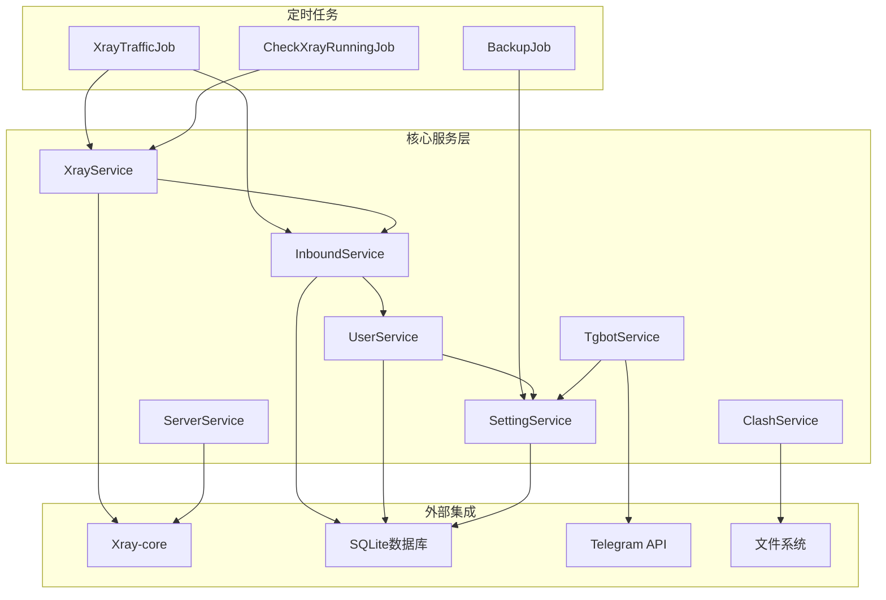
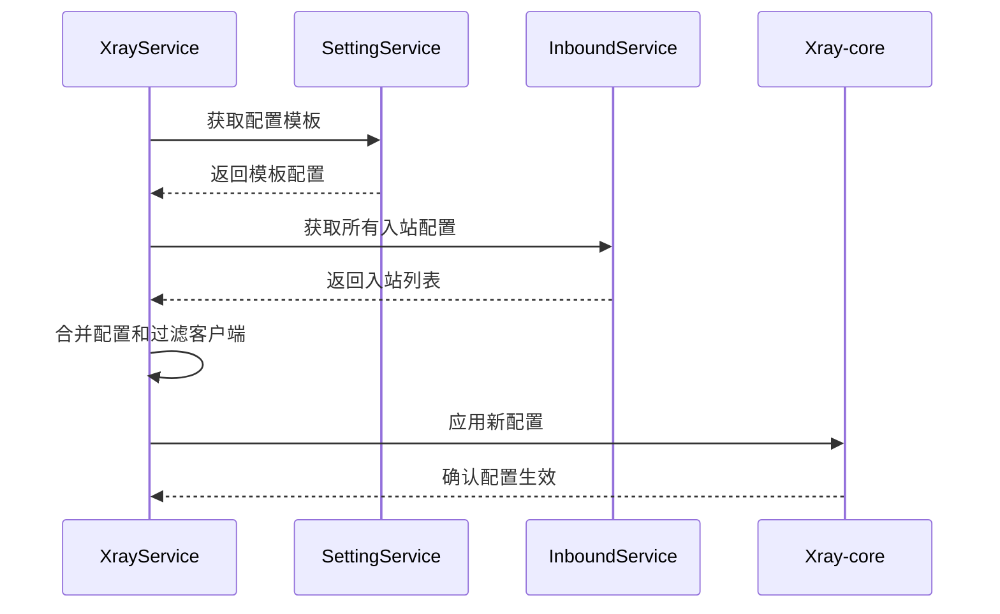
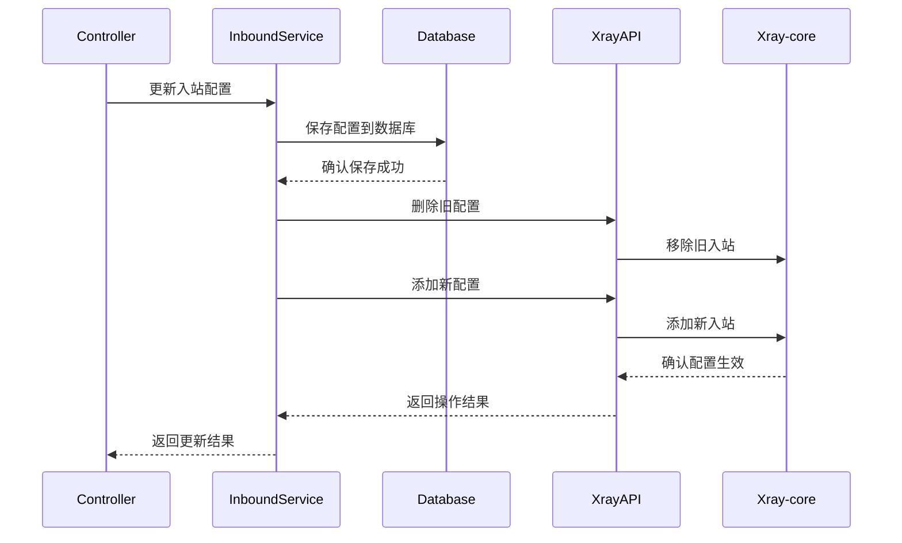
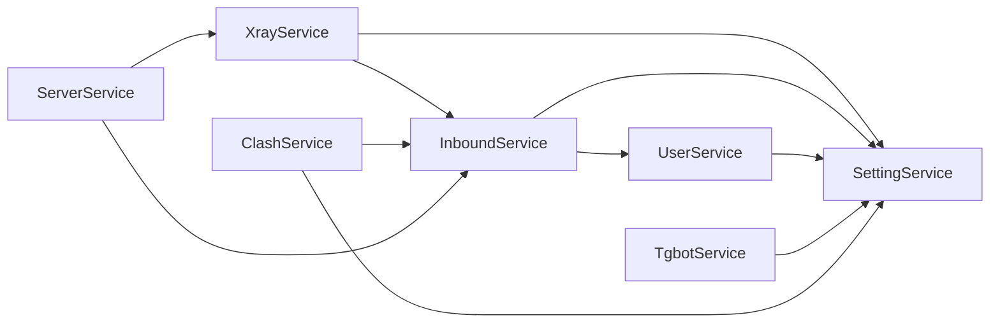

# 3x-ui 核心服务文档

## 🎯 服务架构概览

3x-ui 的核心业务逻辑通过多个服务层组件实现，每个服务负责特定的功能域，通过依赖注入和接口设计实现松耦合架构。



## 🔧 核心服务详解

### 1. XrayService - Xray 核心管理服务

XrayService 是系统的核心服务，负责 Xray-core 的生命周期管理、配置生成和流量统计。

#### 主要功能

```go
type XrayService struct {
    inboundService InboundService
    settingService SettingService
    xrayAPI        xray.XrayAPI
}

// 核心方法
func (s *XrayService) RestartXray(isForce bool) error
func (s *XrayService) GetXrayConfig() (*xray.Config, error)
func (s *XrayService) GetXrayTraffic() ([]*xray.Traffic, []*xray.ClientTraffic, error)
func (s *XrayService) IsXrayRunning() bool
```

#### 配置生成流程



#### 关键实现

```go
func (s *XrayService) GetXrayConfig() (*xray.Config, error) {
    // 1. 获取配置模板（优先数据库，回退到默认文件配置）
    templateConfig, err := s.settingService.GetXrayConfigTemplate()
    if err != nil {
        return nil, err
    }

    // 2. 解析基础配置
    xrayConfig := &xray.Config{}
    err = json.Unmarshal([]byte(templateConfig), xrayConfig)
    if err != nil {
        return nil, err
    }

    // 3. 获取所有启用的入站配置
    inbounds, err := s.inboundService.GetAllInbounds()
    if err != nil {
        return nil, err
    }

    // ... 处理入站配置 ...

    // 4. 动态更新配置模板到数据库（确保配置同步）
    s.updateXrayTemplateConfig(xrayConfig)

    return xrayConfig, nil
}
    
    // 4. 处理每个入站配置
    for _, inbound := range inbounds {
        if !inbound.Enable {
            continue
        }
        
        // 过滤禁用的客户端
        settings := map[string]any{}
        json.Unmarshal([]byte(inbound.Settings), &settings)
        clients := settings["clients"].([]any)
        
        // 检查客户端状态并移除过期/禁用的客户端
        for _, clientTraffic := range inbound.ClientStats {
            for index, client := range clients {
                c := client.(map[string]any)
                if c["email"] == clientTraffic.Email && !clientTraffic.Enable {
                    clients = RemoveIndex(clients, index)
                    logger.Infof("Remove client %s due to expiration", c["email"])
                }
            }
        }
        
        // 添加到 Xray 配置
        xrayConfig.InboundConfigs = append(xrayConfig.InboundConfigs, 
            inbound.GenXrayInboundConfig())
    }
    
    return xrayConfig, nil
}
```

#### 流量统计

```go
func (s *XrayService) GetXrayTraffic() ([]*xray.Traffic, []*xray.ClientTraffic, error) {
    if !s.IsXrayRunning() {
        return nil, nil, errors.New("xray is not running")
    }
    
    // 初始化 gRPC API 连接
    apiPort := p.GetAPIPort()
    s.xrayAPI.Init(apiPort)
    defer s.xrayAPI.Close()
    
    // 获取流量数据并重置计数器
    traffic, clientTraffic, err := s.xrayAPI.GetTraffic(true)
    if err != nil {
        return nil, nil, err
    }
    
    return traffic, clientTraffic, nil
}
```

#### 配置模板管理

XrayService 实现了智能的配置模板管理机制：

```go
// updateXrayTemplateConfig 动态更新配置模板
func (s *XrayService) updateXrayTemplateConfig(xrayConfig *xray.Config) {
    // 将当前实际运行的配置序列化为JSON
    configBytes, err := json.MarshalIndent(xrayConfig, "", "  ")
    if err != nil {
        logger.Warning("Failed to marshal xray template config:", err)
        return
    }

    // 保存到数据库，确保配置模板与实际运行配置同步
    err = s.settingService.SaveXrayTemplateConfig(string(configBytes))
    if err != nil {
        logger.Warning("Failed to save xray template config:", err)
    } else {
        logger.Info("Successfully updated xrayTemplateConfig in database")
    }
}
```

**配置优先级**：
1. **数据库配置** (`xrayTemplateConfig`) - 最高优先级（如果存在）
2. **默认文件配置** (`web/service/config.json`) - 基础模板配置

**配置文件层次**：
```
web/service/config.json (编译时嵌入的纯净模板)
    ↓ (程序启动时)
数据库 xrayTemplateConfig (可选的自定义模板)
    ↓ (合并用户入站配置)
bin/config.json (Xray实际读取的完整配置)
```

**重要特性**：
- ✅ **纯净模板**：默认配置只包含基础组件（API、路由、统计）
- ✅ **动态合并**：运行时将模板与用户入站配置合并
- ✅ **避免重复**：不会将完整配置写回模板，防止重复添加
- ✅ **向后兼容**：即使数据库损坏，仍能使用默认配置启动

### 2. InboundService - 入站配置管理服务

InboundService 负责入站配置的 CRUD 操作、客户端管理和流量统计。

#### 核心功能

```go
type InboundService struct {
    xrayApi xray.XrayAPI
}

// 主要方法
func (s *InboundService) GetInbounds(userId int) ([]*model.Inbound, error)
func (s *InboundService) AddInbound(inbound *model.Inbound) (*model.Inbound, bool, error)
func (s *InboundService) UpdateInbound(inbound *model.Inbound) (*model.Inbound, bool, error)
func (s *InboundService) AddTraffic(traffics []*xray.Traffic, clientTraffics []*xray.ClientTraffic) (error, bool)
```

#### 入站配置更新流程



#### 流量统计处理

```go
func (s *InboundService) AddTraffic(inboundTraffics []*xray.Traffic, 
    clientTraffics []*xray.ClientTraffic) (error, bool) {
    
    db := database.GetDB()
    tx := db.Begin()
    
    defer func() {
        if err != nil {
            tx.Rollback()
        } else {
            tx.Commit()
        }
    }()
    
    // 1. 更新入站流量统计
    err = s.addInboundTraffic(tx, inboundTraffics)
    if err != nil {
        return err, false
    }
    
    // 2. 更新客户端流量统计
    err = s.addClientTraffic(tx, clientTraffics)
    if err != nil {
        return err, false
    }
    
    // 3. 自动续期客户端
    needRestart, count, err := s.autoRenewClients(tx)
    if err != nil {
        logger.Warning("Error in renew clients:", err)
    } else if count > 0 {
        logger.Debugf("%v clients renewed", count)
    }
    
    return nil, needRestart
}
```

### 3. UserService - 用户认证服务

UserService 处理用户认证、密码管理和双因子认证。

#### 认证流程

```go
func (s *UserService) CheckUser(username, password, twoFactorCode string) *model.User {
    db := database.GetDB()
    user := &model.User{}
    
    // 1. 查找用户
    err := db.Model(model.User{}).
        Where("username = ?", username).
        First(user).Error
    if err != nil {
        return nil
    }
    
    // 2. 验证密码
    if !crypto.CheckPasswordHash(user.Password, password) {
        return nil
    }
    
    // 3. 验证双因子认证
    twoFactorEnable, err := s.settingService.GetTwoFactorEnable()
    if err != nil {
        return nil
    }
    
    if twoFactorEnable {
        twoFactorToken, err := s.settingService.GetTwoFactorToken()
        if err != nil || !gotp.NewDefaultTOTP(twoFactorToken).Verify(twoFactorCode, time.Now().Unix()) {
            return nil
        }
    }
    
    return user
}
```

### 4. SettingService - 配置管理服务

SettingService 管理系统的所有配置项，提供类型安全的配置访问接口。

#### 配置管理架构

```go
type SettingService struct{}

// 配置访问方法
func (s *SettingService) getString(key string) (string, error)
func (s *SettingService) getBool(key string) (bool, error)
func (s *SettingService) getInt(key string) (int, error)
func (s *SettingService) setString(key string, value string) error

// 具体配置项访问
func (s *SettingService) GetWebPort() (int, error)
func (s *SettingService) GetBasePath() (string, error)
func (s *SettingService) GetSecret() ([]byte, error)
func (s *SettingService) GetTgBotToken() (string, error)
```

#### 默认配置管理

```go
var defaultValueMap = map[string]string{
    "webPort":                     "2053",
    "webBasePath":                 "/",
    "secret":                      random.Seq(32),
    "sessionMaxAge":               "60",
    "pageSize":                    "50",
    "tgBotEnable":                 "false",
    "tgBotToken":                  "",
    "xrayTemplateConfig":          xrayTemplateConfig,
    // ... 更多配置项
}

func (s *SettingService) getString(key string) (string, error) {
    setting, err := s.getSetting(key)
    if database.IsNotFound(err) {
        // 自动创建缺失的配置项
        value, ok := defaultValueMap[key]
        if !ok {
            return "", common.NewErrorf("key <%v> not found", key)
        }
        
        if err := s.saveSetting(key, value); err != nil {
            logger.Warning("Failed to save default setting:", key, err)
        }
        return value, nil
    }
    
    return setting.Value, nil
}
```

### 5. TgbotService - Telegram Bot 集成

TgbotService 提供 Telegram Bot 功能，支持远程管理和通知。

#### Bot 命令处理

```go
type Tgbot struct {
    bot     *telego.Bot
    botToken string
    chatIds []int64
}

func (t *Tgbot) HandleCommand(update telego.Update) {
    message := update.Message
    if message == nil {
        return
    }
    
    command := message.Text
    chatId := message.Chat.ID
    
    switch {
    case strings.HasPrefix(command, "/start"):
        t.SendMessage(chatId, "欢迎使用 3x-ui Bot")
    case strings.HasPrefix(command, "/status"):
        t.SendSystemStatus(chatId)
    case strings.HasPrefix(command, "/backup"):
        t.SendBackupToAdmins()
    case strings.HasPrefix(command, "/restart"):
        t.RestartXrayService(chatId)
    }
}
```

## ⏰ 定时任务系统

### 1. 任务调度架构

```go
func (s *Server) startTask() {
    // 启动 Xray 服务
    err := s.xrayService.RestartXray(true)
    if err != nil {
        logger.Warning("start xray failed:", err)
    }
    
    // 每秒检查 Xray 运行状态
    s.cron.AddJob("@every 1s", job.NewCheckXrayRunningJob())
    
    // 每30秒检查是否需要重启 Xray
    s.cron.AddFunc("@every 30s", func() {
        if s.xrayService.IsNeedRestartAndSetFalse() {
            err := s.xrayService.RestartXray(false)
            if err != nil {
                logger.Error("restart xray failed:", err)
            }
        }
    })
    
    // 每10秒统计流量（延迟5秒启动，避免与重启检查冲突）
    go func() {
        time.Sleep(time.Second * 5)
        s.cron.AddJob("@every 10s", job.NewXrayTrafficJob())
    }()

    // 每30秒检查在线客户端（独立于流量统计，延迟10秒启动）
    go func() {
        time.Sleep(time.Second * 10)
        s.cron.AddJob("@every 30s", job.NewCheckOnlineClientsJob())
    }()

    // 其他定时任务
    s.cron.AddJob("@every 10s", job.NewCheckClientIpJob())  // 客户端IP检查
    s.cron.AddJob("@daily", job.NewClearLogsJob())          // 日志清理
}
```

### 2. 流量统计任务

```go
type XrayTrafficJob struct {
    xrayService    XrayService
    inboundService InboundService
    outboundService OutboundService
    settingService SettingService
}

func (j *XrayTrafficJob) Run() {
    if !j.xrayService.IsXrayRunning() {
        return
    }

    // 获取流量数据（重置计数器）
    traffics, clientTraffics, err := j.xrayService.GetXrayTraffic()
    if err != nil {
        return
    }

    // 更新入站流量
    err, needRestart0 := j.inboundService.AddTraffic(traffics, clientTraffics)
    if err != nil {
        logger.Warning("add inbound traffic failed:", err)
    }

    // 更新出站流量
    err, needRestart1 := j.outboundService.AddTraffic(traffics, clientTraffics)
    if err != nil {
        logger.Warning("add outbound traffic failed:", err)
    }

    // 如果需要重启 Xray
    if needRestart0 || needRestart1 {
        j.xrayService.SetToNeedRestart()
    }
}
```

### 3. 在线状态检测任务

为了解决在线状态检测的准确性问题，系统使用独立的任务来管理在线状态：

```go
type CheckOnlineClientsJob struct {
    inboundService InboundService
}

func (j *CheckOnlineClientsJob) Run() {
    err := j.inboundService.UpdateOnlineClients()
    if err != nil {
        logger.Warning("Failed to update online clients:", err)
    }
}

// 在线状态检测逻辑
func (s *XrayService) GetOnlineClients() ([]string, error) {
    // 使用非重置查询来获取所有有统计数据的客户端
    _, clientTraffic, err := s.xrayAPI.GetTraffic(false)
    if err != nil {
        return nil, err
    }

    onlineClients := make([]string, 0, len(clientTraffic))
    for _, traffic := range clientTraffic {
        onlineClients = append(onlineClients, traffic.Email)
    }

    return onlineClients, nil
}
```

**关键改进**：
- ✅ **分离关注点**：流量统计和在线状态检测分开处理
- ✅ **准确的在线检测**：使用非重置查询获取累计统计数据
- ✅ **合理的检测频率**：每30秒检测一次在线状态
- ✅ **避免误判**：不会因为短期无流量而误判为离线

## 🔄 服务间交互

### 1. 依赖关系图



### 2. 事件驱动架构

```go
// 配置变更事件
type ConfigChangeEvent struct {
    Type   string
    Target string
    Data   interface{}
}

// 事件处理
func (s *XrayService) HandleConfigChange(event ConfigChangeEvent) {
    switch event.Type {
    case "inbound_added":
        s.SetToNeedRestart()
    case "inbound_updated":
        s.SetToNeedRestart()
    case "setting_changed":
        if event.Target == "xrayTemplateConfig" {
            s.SetToNeedRestart()
        }
    }
}
```

## 🛡️ 错误处理和恢复

### 1. 服务健康检查

```go
func (j *CheckXrayRunningJob) Run() {
    if !j.xrayService.IsXrayRunning() {
        logger.Warning("Xray is not running, attempting to restart")
        
        err := j.xrayService.RestartXray(true)
        if err != nil {
            logger.Error("Failed to restart Xray:", err)
            // 发送告警通知
            j.tgbotService.SendAlert("Xray 重启失败: " + err.Error())
        }
    }
}
```

### 2. 事务处理

```go
func (s *InboundService) UpdateInbound(inbound *model.Inbound) (*model.Inbound, bool, error) {
    db := database.GetDB()
    tx := db.Begin()
    
    defer func() {
        if err != nil {
            tx.Rollback()
            logger.Error("Transaction rolled back:", err)
        } else {
            tx.Commit()
        }
    }()
    
    // 数据库操作
    err = tx.Save(inbound).Error
    if err != nil {
        return nil, false, err
    }
    
    // Xray API 操作
    needRestart := s.updateXrayConfig(inbound)
    
    return inbound, needRestart, nil
}
```

## 📊 性能监控

### 1. 服务指标收集

```go
type ServiceMetrics struct {
    RequestCount    int64
    ErrorCount      int64
    ResponseTime    time.Duration
    ActiveConnections int
}

func (s *XrayService) CollectMetrics() ServiceMetrics {
    return ServiceMetrics{
        RequestCount:      atomic.LoadInt64(&s.requestCount),
        ErrorCount:        atomic.LoadInt64(&s.errorCount),
        ResponseTime:      s.avgResponseTime,
        ActiveConnections: len(s.GetOnlineClients()),
    }
}
```

### 2. 日志记录

```go
func (s *XrayService) RestartXray(isForce bool) error {
    logger.Info("Restarting Xray service", 
        "force", isForce,
        "current_status", s.IsXrayRunning())
    
    start := time.Now()
    defer func() {
        logger.Info("Xray restart completed",
            "duration", time.Since(start),
            "success", s.IsXrayRunning())
    }()
    
    // 重启逻辑...
}
```

---

*下一步: 查看 [流程图和时序图](./07-diagrams.md) 了解详细的业务流程*
