# 3x-ui 流程图和时序图

## 📊 业务流程可视化

本文档提供了 3x-ui 系统中关键业务流程的详细时序图和流程图，帮助理解系统的工作机制和组件间的交互关系。

## 🔐 用户认证流程

### 1. 登录认证时序图

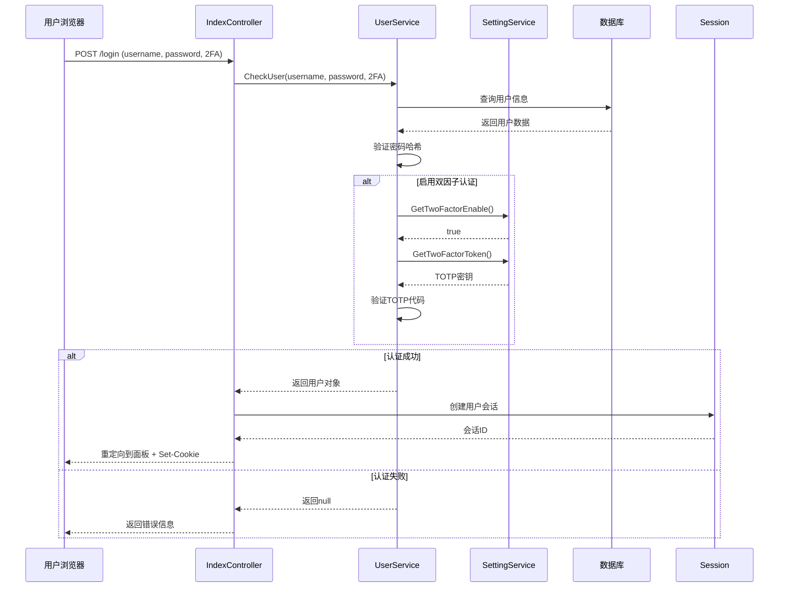

### 2. 会话验证流程

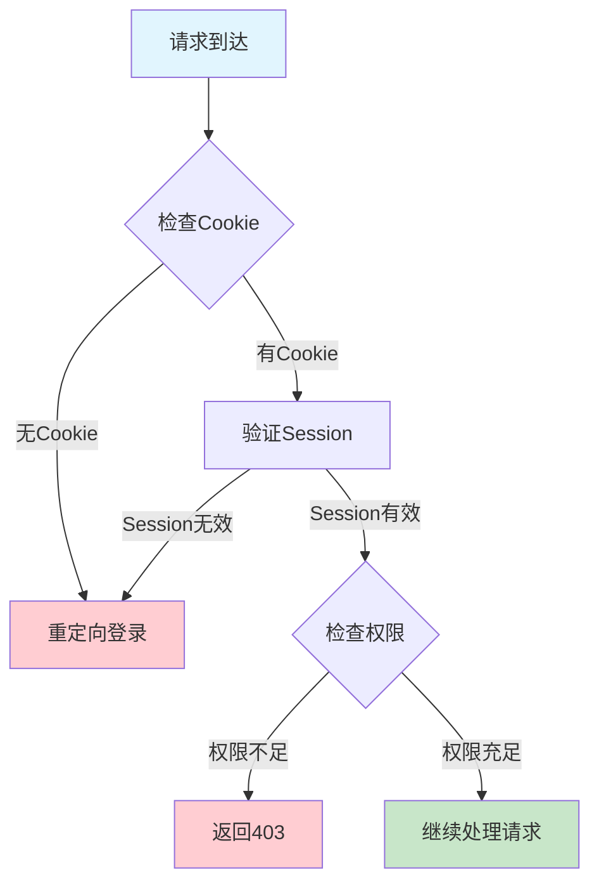

## 🔧 Xray 配置管理流程

### 1. 配置生成和应用时序图

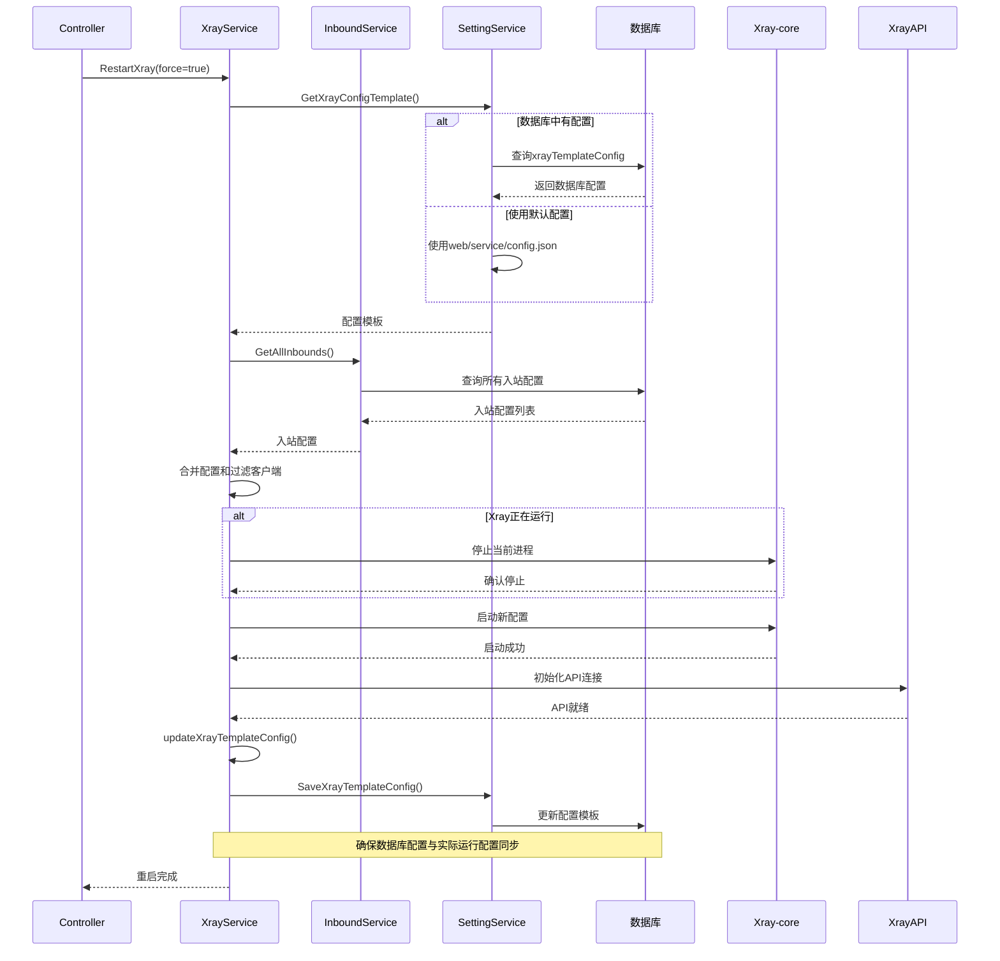

### 2. 入站配置更新流程

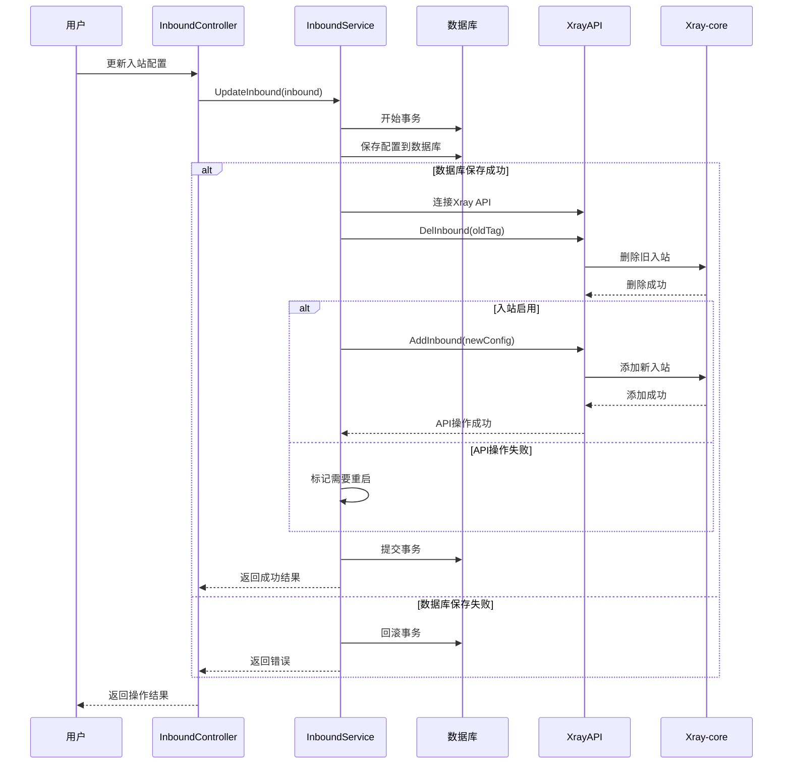

## 📊 流量统计流程

### 1. 流量收集和处理时序图

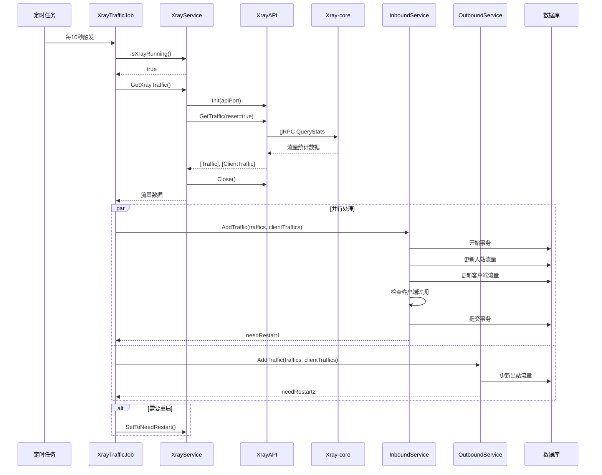

### 2. 客户端流量限制检查流程

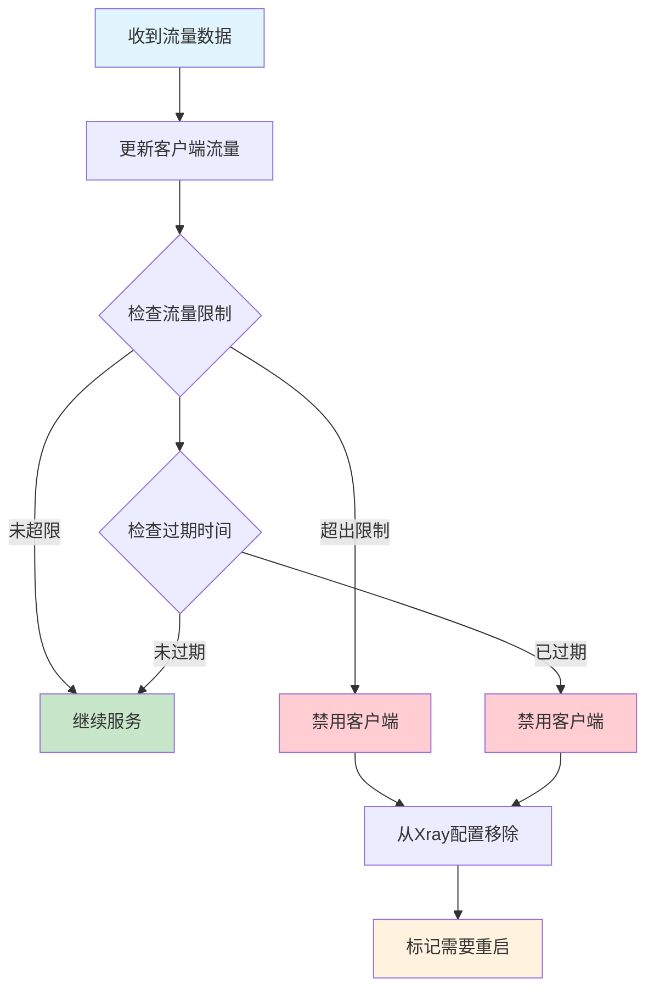

## 🤖 Telegram Bot 交互流程

### 1. Bot 命令处理时序图

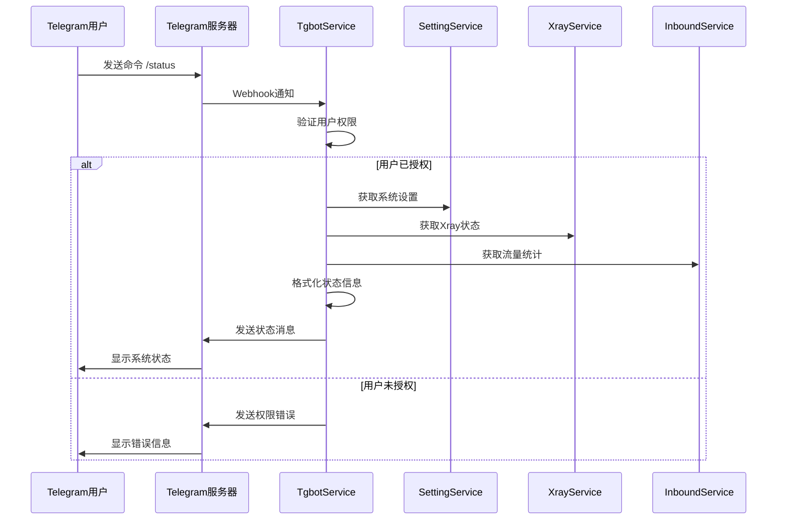

### 2. 自动备份通知流程

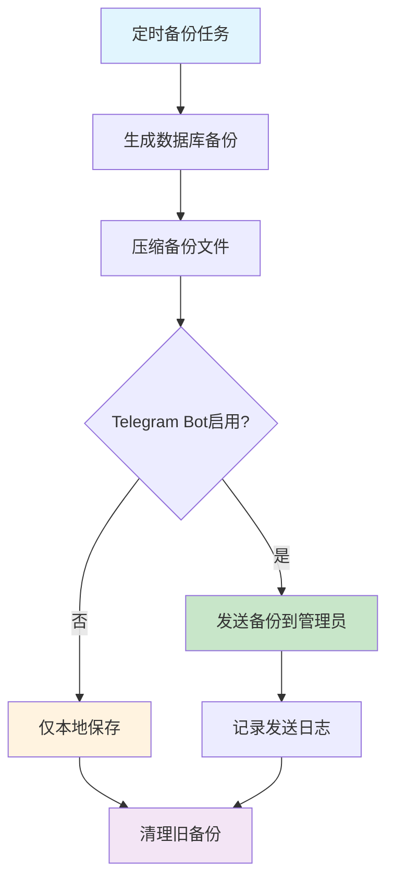

## 🔄 订阅系统流程

### 1. Clash 订阅生成时序图

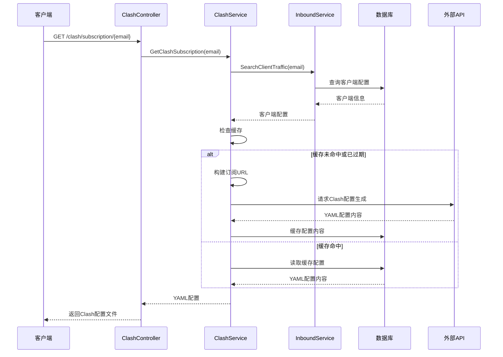

### 2. 订阅链接生成流程

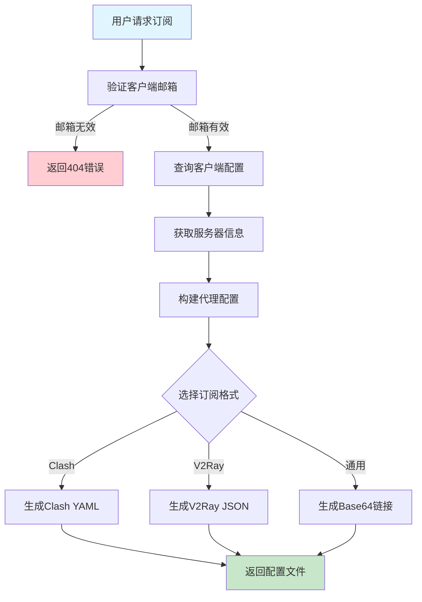

## 🔍 系统监控流程

### 1. 健康检查时序图

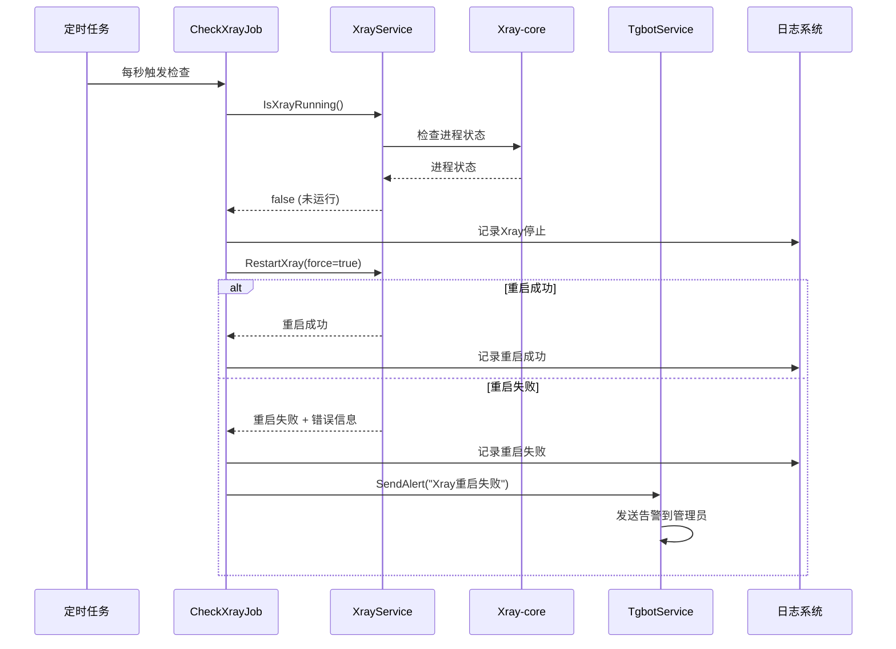

### 2. 性能监控数据收集流程

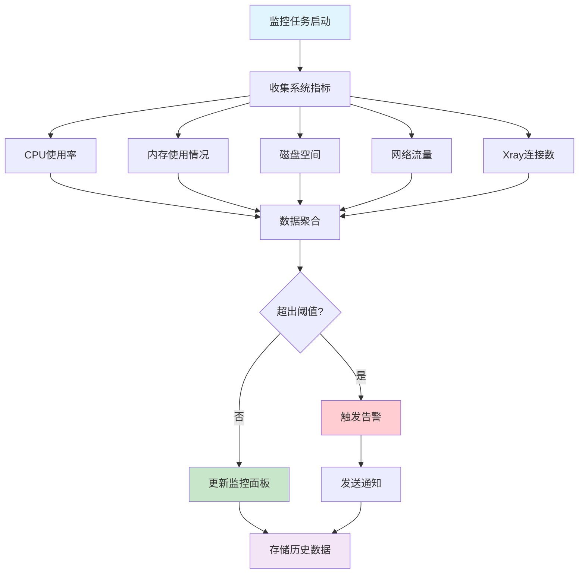

## 🔄 配置同步流程

### 1. 配置变更传播时序图

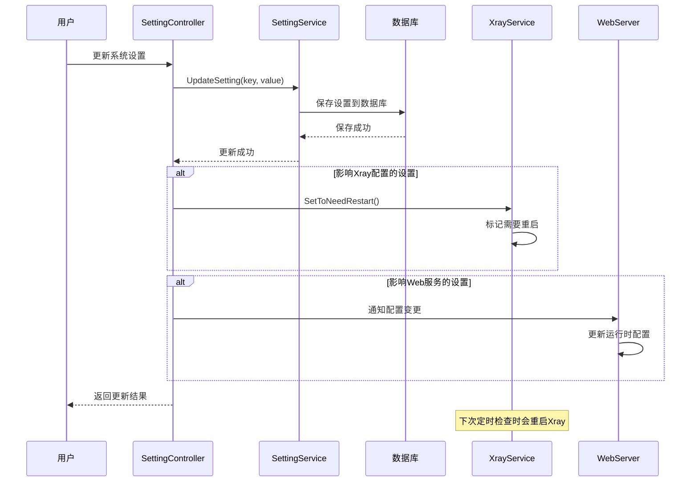

### 2. 数据库迁移流程

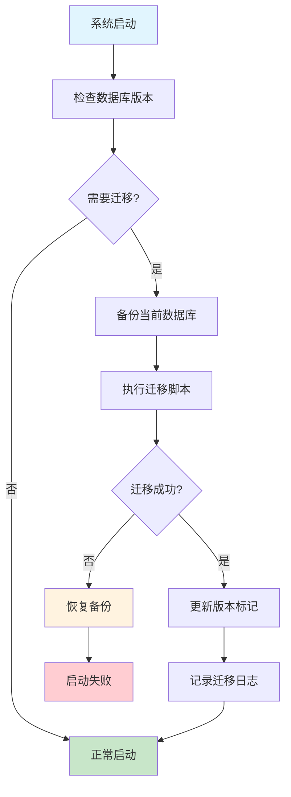

---

*下一步: 查看 [部署运维指南](./08-deployment.md) 了解系统部署和运维*
