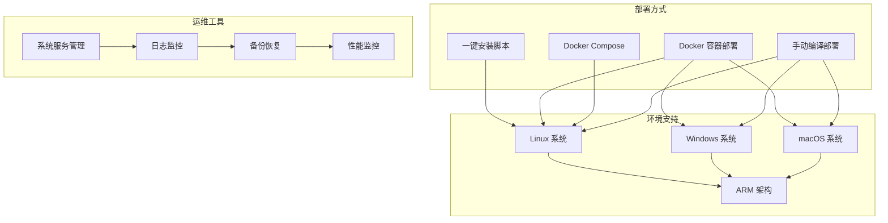
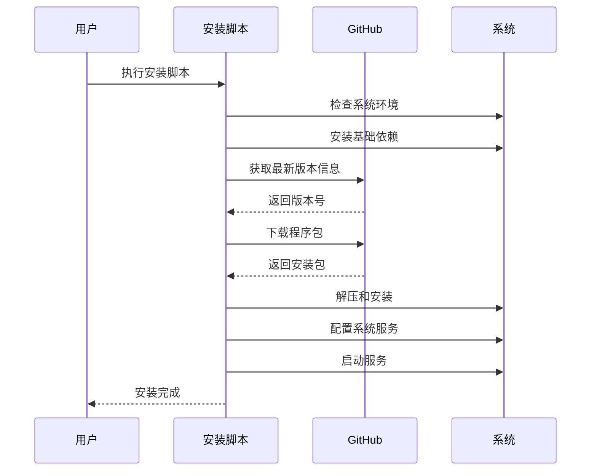
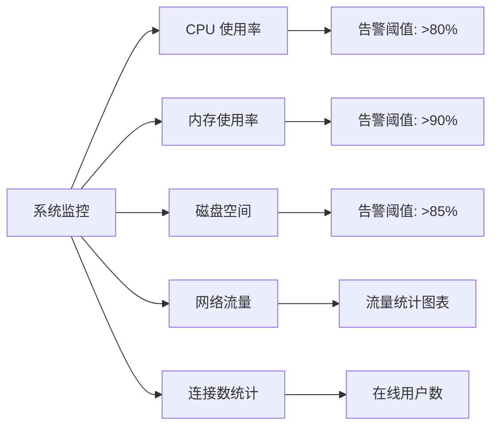

# 3x-ui 部署运维指南

## 🚀 部署方式概览

3x-ui 支持多种部署方式，适应不同的环境需求和运维场景。



## 📋 系统要求

### 最低配置要求

| 组件         | 最低要求            | 推荐配置                  |
| ------------ | ------------------- | ------------------------- |
| **操作系统** | Linux/Windows/macOS | Ubuntu 20.04+ / CentOS 8+ |
| **CPU**      | 1 核心              | 2 核心以上                |
| **内存**     | 512MB RAM           | 1GB+ RAM                  |
| **存储**     | 100MB 可用空间      | 1GB+ 可用空间             |
| **网络**     | 稳定网络连接        | 带宽 ≥ 10Mbps             |

### 支持的架构

- **x86_64** (amd64)
- **ARM64** (aarch64)
- **ARMv7** (arm)
- **ARMv6** (arm)
- **ARMv5** (arm)

## 🔧 一键安装部署

### 1. 快速安装

```bash
# 安装最新版本
bash <(curl -Ls https://raw.githubusercontent.com/agassiz/3x-ui/master/install.sh)

# 安装指定版本
bash <(curl -Ls https://raw.githubusercontent.com/agassiz/3x-ui/master/install.sh) v2.3.5
```

### 2. 安装流程详解



### 3. 安装后配置

```bash
# 查看服务状态
systemctl status x-ui

# 查看日志
journalctl -u x-ui -f

# 重启服务
systemctl restart x-ui

# 停止服务
systemctl stop x-ui

# 启用开机自启
systemctl enable x-ui
```

## 🐳 Docker 部署

### 1. 生产环境部署

#### 使用 Docker Compose (推荐)

```yaml
# docker-compose.yml
services:
  3xui:
    build:
      context: .
      dockerfile: ./Dockerfile
    container_name: 3xui_app
    volumes:
      - $PWD/db/:/etc/x-ui/ # 数据库持久化
      - $PWD/cert/:/root/cert/ # SSL证书目录
    environment:
      XRAY_VMESS_AEAD_FORCED: "false"
      XUI_ENABLE_FAIL2BAN: "true"
    tty: true
    network_mode: host # 使用主机网络
    restart: unless-stopped
```

#### 启动命令

```bash
# 启动服务
docker-compose up -d

# 查看日志
docker-compose logs -f

# 停止服务
docker-compose down

# 重启服务
docker-compose restart
```

### 2. 开发环境部署

#### 快速开发环境

```bash
# 一键启动开发环境
./docker-dev.sh

# 强制重新构建
./docker-dev.sh --rebuild

# 查看开发环境日志
docker logs -f 3xui_app_dev
```

#### 开发环境特性

- **热重载**: HTML/CSS/JS 文件修改后立即生效
- **快速重建**: Go 代码修改后 5-7 秒重建
- **分层缓存**: 智能缓存策略，提升构建速度
- **调试模式**: 启用详细日志和错误信息

### 3. Docker 构建优化

#### 多阶段构建 (Dockerfile)

```dockerfile
# ========================================================
# Stage: Builder
# ========================================================
FROM golang:1.24-alpine AS builder
WORKDIR /app
ARG TARGETARCH

# 安装构建依赖
RUN apk --no-cache --update add \
  build-base \
  gcc \
  wget \
  unzip

COPY . .

# 设置编译环境
ENV CGO_ENABLED=1
ENV CGO_CFLAGS="-D_LARGEFILE64_SOURCE"

# 下载 Xray 依赖
RUN mkdir -p build
RUN ./DockerInit.sh "$TARGETARCH"

# 编译应用
RUN go build -ldflags "-w -s" -o build/x-ui main.go

# ========================================================
# Stage: Final Image
# ========================================================
FROM alpine
ENV TZ=Asia/Shanghai
WORKDIR /app

# 安装运行时依赖
RUN apk add --no-cache --update \
  ca-certificates \
  tzdata \
  fail2ban \
  bash

# 复制构建产物
COPY --from=builder /app/build/ /app/
COPY --from=builder /app/DockerEntrypoint.sh /app/
COPY --from=builder /app/x-ui.sh /usr/bin/x-ui

# 配置 fail2ban
RUN rm -f /etc/fail2ban/jail.d/alpine-ssh.conf \
  && cp /etc/fail2ban/jail.conf /etc/fail2ban/jail.local \
  && sed -i "s/^\[ssh\]$/&\nenabled = false/" /etc/fail2ban/jail.local

# 设置权限
RUN chmod +x \
  /app/DockerEntrypoint.sh \
  /app/x-ui \
  /usr/bin/x-ui

ENV XUI_ENABLE_FAIL2BAN="true"
VOLUME [ "/etc/x-ui" ]
CMD [ "./x-ui" ]
ENTRYPOINT [ "/app/DockerEntrypoint.sh" ]
```

## ⚙️ 配置管理

### 1. 核心配置项

```bash
# Web 服务配置
webPort=2053                    # Web 端口
webBasePath=/                   # 基础路径
webDomain=                      # 域名限制
webCertFile=                    # SSL 证书文件
webKeyFile=                     # SSL 私钥文件

# 安全配置
secret=<random_string>          # 会话密钥
sessionMaxAge=60               # 会话超时(分钟)
twoFactorEnable=false          # 双因子认证

# Telegram Bot 配置
tgBotEnable=false              # 启用 Bot
tgBotToken=                    # Bot Token
tgBotChatId=                   # 管理员 Chat ID
tgBotBackup=false              # 自动备份
tgBotLoginNotify=true          # 登录通知

# 订阅服务配置
subEnable=false                # 启用订阅
subPort=2096                   # 订阅端口
subPath=/sub/                  # 订阅路径
subEncrypt=true                # 加密订阅
```

### 2. 环境变量配置

```bash
# Docker 环境变量
XRAY_VMESS_AEAD_FORCED=false   # VMESS AEAD 强制
XUI_ENABLE_FAIL2BAN=true       # 启用 Fail2ban
XUI_DEBUG=false                # 调试模式
TZ=Asia/Shanghai               # 时区设置
```

### 3. Xray 配置模板

```json
{
  "log": {
    "access": "none",
    "dnsLog": false,
    "error": "",
    "loglevel": "warning",
    "maskAddress": ""
  },
  "api": {
    "tag": "api",
    "services": ["HandlerService", "LoggerService", "StatsService"]
  },
  "inbounds": [
    {
      "tag": "api",
      "listen": "127.0.0.1",
      "port": 62789,
      "protocol": "dokodemo-door",
      "settings": {
        "address": "127.0.0.1"
      }
    }
  ],
  "outbounds": [
    {
      "tag": "direct",
      "protocol": "freedom",
      "settings": {
        "domainStrategy": "AsIs"
      }
    },
    {
      "tag": "blocked",
      "protocol": "blackhole",
      "settings": {}
    }
  ],
  "policy": {
    "levels": {
      "0": {
        "statsUserDownlink": true,
        "statsUserUplink": true
      }
    },
    "system": {
      "statsInboundDownlink": true,
      "statsInboundUplink": true
    }
  },
  "routing": {
    "domainStrategy": "AsIs",
    "rules": [
      {
        "type": "field",
        "inboundTag": ["api"],
        "outboundTag": "api"
      }
    ]
  },
  "stats": {}
}
```

## 📊 监控和日志

### 1. 系统监控

#### 服务状态监控

```bash
# 检查服务状态
systemctl status x-ui

# 检查端口占用
netstat -tlnp | grep :2053

# 检查进程
ps aux | grep x-ui

# 检查资源使用
top -p $(pgrep x-ui)
```

#### 性能监控指标



### 2. 日志管理

#### 日志文件位置

```bash
# 系统日志
/var/log/x-ui/x-ui.log          # 应用日志
/var/log/x-ui/access.log        # 访问日志
/var/log/x-ui/error.log         # 错误日志

# Systemd 日志
journalctl -u x-ui              # 查看服务日志
journalctl -u x-ui -f           # 实时查看日志
journalctl -u x-ui --since today # 查看今日日志
```

#### 日志级别配置

```json
{
  "log": {
    "loglevel": "warning", // debug, info, warning, error
    "access": "/var/log/x-ui/access.log",
    "error": "/var/log/x-ui/error.log"
  }
}
```

### 3. 告警通知

#### Telegram 告警配置

```bash
# 启用 Telegram 通知
tgBotEnable=true
tgBotToken=<your_bot_token>
tgBotChatId=<your_chat_id>

# 告警阈值设置
tgCpu=80                        # CPU 使用率告警阈值
tgBotLoginNotify=true           # 登录通知
```

## 🔒 安全配置

### 1. 访问控制

#### 域名限制

```bash
# 设置允许访问的域名
webDomain=your-domain.com

# 基础路径设置（隐藏管理面板）
webBasePath=/admin/
```

#### IP 白名单

```bash
# 使用 iptables 限制访问
iptables -A INPUT -p tcp --dport 2053 -s 192.168.1.0/24 -j ACCEPT
iptables -A INPUT -p tcp --dport 2053 -j DROP
```

### 2. SSL/TLS 配置

#### 证书配置

```bash
# 设置 SSL 证书
webCertFile=/root/cert/cert.pem
webKeyFile=/root/cert/private.key

# 使用 Let's Encrypt
certbot certonly --standalone -d your-domain.com
```

### 3. Fail2ban 防护

#### 配置文件

```ini
# /etc/fail2ban/jail.local
[x-ui]
enabled = true
port = 2053
filter = x-ui
logpath = /var/log/x-ui/access.log
maxretry = 5
bantime = 3600
findtime = 600
```

## 💾 备份和恢复

### 1. 数据备份

#### 自动备份脚本

```bash
#!/bin/bash
# backup.sh

BACKUP_DIR="/backup/x-ui"
DATE=$(date +%Y%m%d_%H%M%S)
DB_PATH="/etc/x-ui/x-ui.db"

# 创建备份目录
mkdir -p $BACKUP_DIR

# 备份数据库
cp $DB_PATH $BACKUP_DIR/x-ui_$DATE.db

# 备份配置文件
tar -czf $BACKUP_DIR/config_$DATE.tar.gz /etc/x-ui/

# 清理旧备份（保留7天）
find $BACKUP_DIR -name "*.db" -mtime +7 -delete
find $BACKUP_DIR -name "*.tar.gz" -mtime +7 -delete

echo "Backup completed: $DATE"
```

#### 定时备份

```bash
# 添加到 crontab
crontab -e

# 每天凌晨2点备份
0 2 * * * /usr/local/bin/backup.sh
```

### 2. 数据恢复

```bash
# 停止服务
systemctl stop x-ui

# 恢复数据库
cp /backup/x-ui/x-ui_20250119_020000.db /etc/x-ui/x-ui.db

# 恢复配置
tar -xzf /backup/x-ui/config_20250119_020000.tar.gz -C /

# 启动服务
systemctl start x-ui
```

## 🔄 升级和维护

### 1. 版本升级

#### 在线升级

```bash
# 使用管理脚本升级
x-ui update

# 或使用安装脚本升级
bash <(curl -Ls https://raw.githubusercontent.com/agassiz/3x-ui/master/install.sh)
```

#### Docker 升级

```bash
# 拉取最新镜像
docker-compose pull

# 重新启动服务
docker-compose up -d
```

### 2. 维护任务

#### 定期维护清单

```bash
# 每周维护任务
- 检查系统资源使用情况
- 清理日志文件
- 检查备份完整性
- 更新系统补丁

# 每月维护任务
- 检查软件版本更新
- 优化数据库性能
- 审查安全配置
- 测试备份恢复流程
```

## 🚨 故障排除

### 1. 常见问题

#### 服务无法启动

```bash
# 检查端口占用
netstat -tlnp | grep :2053

# 检查配置文件
x-ui setting -show

# 查看详细错误
journalctl -u x-ui -n 50
```

#### 无法访问面板

```bash
# 检查防火墙
ufw status
iptables -L

# 检查服务状态
systemctl status x-ui

# 重置管理员账户
x-ui setting -username admin -password admin
```

### 2. 性能优化

#### 系统优化

```bash
# 调整文件描述符限制
echo "* soft nofile 65535" >> /etc/security/limits.conf
echo "* hard nofile 65535" >> /etc/security/limits.conf

# 优化网络参数
echo "net.core.rmem_max = 134217728" >> /etc/sysctl.conf
echo "net.core.wmem_max = 134217728" >> /etc/sysctl.conf
sysctl -p
```

---

_下一步: 查看 [开发指南](./09-development-guide.md) 了解开发环境搭建_
