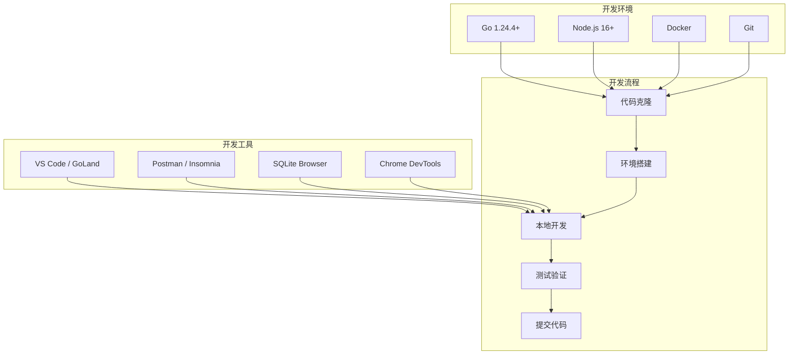
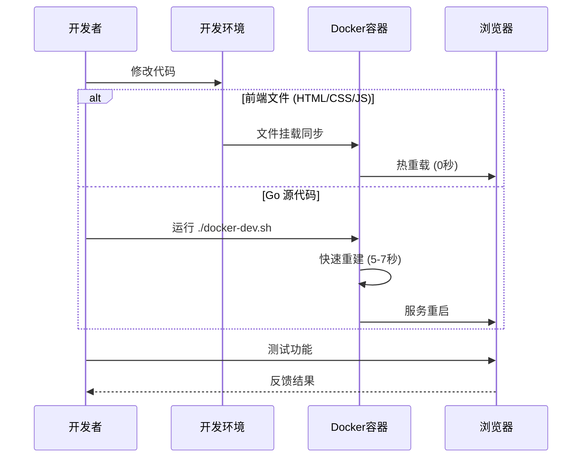

# 3x-ui 开发指南

## 🎯 开发环境概览

本指南将帮助您快速搭建 3x-ui 的开发环境，了解项目结构，掌握开发流程和代码规范。



## 🛠️ 环境要求

### 基础环境

| 工具 | 版本要求 | 说明 |
|------|----------|------|
| **Go** | 1.24.4+ | 主要开发语言 |
| **Node.js** | 16+ | 前端工具链 |
| **Git** | 2.0+ | 版本控制 |
| **Docker** | 20.0+ | 容器化开发 |

### 推荐工具

- **IDE**: VS Code, GoLand, Vim
- **API 测试**: Postman, Insomnia
- **数据库**: SQLite Browser, DBeaver
- **浏览器**: Chrome (开发者工具)

## 🚀 快速开始

### 1. 克隆项目

```bash
# 克隆仓库
git clone https://github.com/agassiz/3x-ui.git
cd 3x-ui

# 查看项目结构
tree -L 2
```

### 2. 开发环境搭建

#### 方式一：Docker 开发环境 (推荐)

```bash
# 一键启动开发环境
./docker-dev.sh

# 访问开发环境
open http://localhost:54321
```

**开发环境特性**:
- ✅ **真正的热重载** - HTML/CSS/JS 修改立即生效
- ✅ **快速重建** - Go 代码修改后 5-7 秒重建
- ✅ **智能缓存** - 分层构建缓存，提升构建速度
- ✅ **调试模式** - 详细日志和错误信息

#### 方式二：本地开发环境

```bash
# 安装 Go 依赖
go mod download

# 初始化 Xray 依赖
./DockerInit.sh

# 编译项目
go build -o x-ui main.go

# 运行项目
./x-ui
```

### 3. 开发工作流



## 📁 项目结构详解

```
3x-ui/
├── main.go                     # 应用入口点
├── go.mod                      # Go 模块定义
├── go.sum                      # 依赖版本锁定
│
├── config/                     # 配置管理
│   ├── config.go              # 配置读取逻辑
│   ├── name                   # 项目名称
│   └── version                # 版本信息
│
├── database/                   # 数据库层
│   ├── db.go                  # 数据库初始化
│   └── model/                 # 数据模型
│       └── model.go           # 实体定义
│
├── web/                       # Web 层
│   ├── web.go                 # Web 服务器
│   ├── controller/            # 控制器
│   │   ├── base.go           # 基础控制器
│   │   ├── index.go          # 首页控制器
│   │   ├── inbound.go        # 入站管理
│   │   └── setting.go        # 设置管理
│   ├── service/               # 业务服务
│   │   ├── user.go           # 用户服务
│   │   ├── inbound.go        # 入站服务
│   │   └── xray.go           # Xray 服务
│   ├── middleware/            # 中间件
│   ├── assets/                # 静态资源
│   │   ├── css/              # 样式文件
│   │   ├── js/               # JavaScript
│   │   └── img/              # 图片资源
│   ├── html/                  # HTML 模板
│   │   ├── index.html        # 主页模板
│   │   ├── login.html        # 登录页面
│   │   ├── component/        # 可复用组件
│   │   └── modals/           # 模态框组件
│   └── translation/           # 国际化文件
│       ├── en.toml           # 英语
│       └── zh.toml           # 中文
│
├── xray/                      # Xray 集成
│   ├── api.go                # Xray API 封装
│   ├── config.go             # 配置生成
│   └── process.go            # 进程管理
│
├── util/                      # 工具库
│   ├── common/               # 通用工具
│   ├── crypto/               # 加密工具
│   └── json_util/            # JSON 工具
│
├── sub/                       # 订阅系统
│   ├── sub.go                # 订阅服务
│   └── subController.go      # 订阅控制器
│
├── docs/                      # 技术文档
│   ├── README.md             # 文档导航
│   ├── 01-project-overview.md # 项目概览
│   └── ...                   # 其他文档
│
├── docker-compose.yml         # 生产环境配置
├── docker-compose.dev.yml     # 开发环境配置
├── Dockerfile                 # 生产环境镜像
├── Dockerfile.dev             # 开发环境镜像
├── docker-dev.sh              # 开发环境脚本
└── install.sh                 # 安装脚本
```

## 💻 开发规范

### 1. Go 代码规范

#### 命名规范

```go
// 包名：小写，简洁
package service

// 结构体：大驼峰，首字母大写表示公开
type UserService struct {
    settingService SettingService
}

// 方法名：大驼峰（公开）或小驼峰（私有）
func (s *UserService) GetUser(id int) (*model.User, error) {
    return s.getUser(id)
}

func (s *UserService) getUser(id int) (*model.User, error) {
    // 私有方法实现
}

// 常量：大写，下划线分隔
const (
    DEFAULT_PORT = 2053
    MAX_RETRY    = 3
)

// 变量：小驼峰
var defaultConfig = Config{
    Port: DEFAULT_PORT,
}
```

#### 错误处理

```go
// 统一错误处理模式
func (s *UserService) CreateUser(user *model.User) error {
    if user.Username == "" {
        return common.NewError("username cannot be empty")
    }
    
    if err := s.validateUser(user); err != nil {
        return fmt.Errorf("validation failed: %w", err)
    }
    
    if err := s.saveUser(user); err != nil {
        logger.Error("Failed to save user", "error", err)
        return fmt.Errorf("failed to save user: %w", err)
    }
    
    return nil
}
```

#### 日志规范

```go
import "x-ui/logger"

// 使用结构化日志
logger.Info("User created successfully", 
    "user_id", user.Id,
    "username", user.Username)

logger.Error("Database connection failed",
    "error", err,
    "retry_count", retryCount)

logger.Debug("Processing request",
    "method", c.Request.Method,
    "path", c.Request.URL.Path)
```

### 2. 前端代码规范

#### JavaScript 规范

```javascript
// 使用 const/let，避免 var
const API_BASE_URL = '/panel/api';
let currentUser = null;

// 函数命名：小驼峰
function getUserInfo(userId) {
    return HttpUtil.post(`/user/${userId}`);
}

// 类命名：大驼峰
class InboundManager {
    constructor() {
        this.inbounds = [];
    }
    
    async loadInbounds() {
        try {
            const response = await HttpUtil.post('/inbound/list');
            if (response.success) {
                this.inbounds = response.obj;
            }
        } catch (error) {
            console.error('Failed to load inbounds:', error);
        }
    }
}

// Vue 组件规范
const app = new Vue({
    delimiters: ['[[', ']]'],  // 避免与 Go 模板冲突
    el: '#app',
    data: {
        loading: false,
        inbounds: []
    },
    methods: {
        async fetchData() {
            this.loading = true;
            try {
                const result = await this.loadInbounds();
                this.inbounds = result;
            } finally {
                this.loading = false;
            }
        }
    }
});
```

#### CSS 规范

```css
/* BEM 命名规范 */
.inbound-table {
    width: 100%;
    border-collapse: collapse;
}

.inbound-table__header {
    background-color: #f5f5f5;
    font-weight: bold;
}

.inbound-table__row {
    border-bottom: 1px solid #eee;
}

.inbound-table__row--active {
    background-color: #e6f7ff;
}

.inbound-table__cell {
    padding: 12px;
    text-align: left;
}

.inbound-table__cell--center {
    text-align: center;
}

/* 响应式设计 */
@media (max-width: 768px) {
    .inbound-table {
        font-size: 14px;
    }
    
    .inbound-table__cell {
        padding: 8px;
    }
}
```

### 3. 数据库规范

#### 模型定义

```go
type User struct {
    Id       int    `json:"id" gorm:"primaryKey;autoIncrement"`
    Username string `json:"username" gorm:"type:varchar(50);not null;unique"`
    Password string `json:"password" gorm:"type:varchar(255);not null"`
    
    CreatedAt time.Time `json:"createdAt" gorm:"autoCreateTime"`
    UpdatedAt time.Time `json:"updatedAt" gorm:"autoUpdateTime"`
}

// 表名规范
func (User) TableName() string {
    return "users"
}

// 模型方法
func (u *User) BeforeCreate(tx *gorm.DB) error {
    if u.Password != "" {
        hashedPassword, err := crypto.HashPasswordAsBcrypt(u.Password)
        if err != nil {
            return err
        }
        u.Password = hashedPassword
    }
    return nil
}
```

#### 查询规范

```go
// 使用事务
func (s *InboundService) UpdateInbound(inbound *model.Inbound) error {
    db := database.GetDB()
    tx := db.Begin()
    
    defer func() {
        if r := recover(); r != nil {
            tx.Rollback()
        }
    }()
    
    if err := tx.Save(inbound).Error; err != nil {
        tx.Rollback()
        return err
    }
    
    return tx.Commit().Error
}

// 预加载关联数据
func (s *InboundService) GetInbounds(userId int) ([]*model.Inbound, error) {
    db := database.GetDB()
    var inbounds []*model.Inbound
    
    err := db.Model(model.Inbound{}).
        Preload("ClientStats").
        Where("user_id = ?", userId).
        Find(&inbounds).Error
        
    return inbounds, err
}
```

## 🧪 测试指南

### 1. 单元测试

```go
// user_service_test.go
package service

import (
    "testing"
    "github.com/stretchr/testify/assert"
    "x-ui/database/model"
)

func TestUserService_CreateUser(t *testing.T) {
    // 准备测试数据
    user := &model.User{
        Username: "testuser",
        Password: "testpass",
    }
    
    // 执行测试
    userService := &UserService{}
    err := userService.CreateUser(user)
    
    // 验证结果
    assert.NoError(t, err)
    assert.NotEmpty(t, user.Id)
    assert.NotEqual(t, "testpass", user.Password) // 密码应该被加密
}

func TestUserService_CreateUser_EmptyUsername(t *testing.T) {
    user := &model.User{
        Username: "",
        Password: "testpass",
    }
    
    userService := &UserService{}
    err := userService.CreateUser(user)
    
    assert.Error(t, err)
    assert.Contains(t, err.Error(), "username cannot be empty")
}
```

### 2. 集成测试

```go
// integration_test.go
func TestInboundAPI(t *testing.T) {
    // 启动测试服务器
    router := setupTestRouter()
    
    // 测试添加入站
    inbound := map[string]interface{}{
        "remark":   "test-inbound",
        "protocol": "vmess",
        "port":     10086,
    }
    
    body, _ := json.Marshal(inbound)
    req := httptest.NewRequest("POST", "/panel/inbound/add", bytes.NewBuffer(body))
    req.Header.Set("Content-Type", "application/json")
    
    w := httptest.NewRecorder()
    router.ServeHTTP(w, req)
    
    assert.Equal(t, http.StatusOK, w.Code)
    
    var response map[string]interface{}
    json.Unmarshal(w.Body.Bytes(), &response)
    assert.True(t, response["success"].(bool))
}
```

### 3. 运行测试

```bash
# 运行所有测试
go test ./...

# 运行特定包的测试
go test ./web/service

# 运行测试并显示覆盖率
go test -cover ./...

# 生成覆盖率报告
go test -coverprofile=coverage.out ./...
go tool cover -html=coverage.out
```

## 🔧 调试技巧

### 1. 本地调试

#### VS Code 调试配置

```json
// .vscode/launch.json
{
    "version": "0.2.0",
    "configurations": [
        {
            "name": "Launch 3x-ui",
            "type": "go",
            "request": "launch",
            "mode": "auto",
            "program": "${workspaceFolder}/main.go",
            "env": {
                "XUI_DEBUG": "true"
            },
            "args": []
        }
    ]
}
```

#### 调试日志

```go
// 在代码中添加调试日志
import "x-ui/logger"

func (s *XrayService) RestartXray(isForce bool) error {
    logger.Debug("RestartXray called", 
        "force", isForce,
        "current_running", s.IsXrayRunning())
    
    // 业务逻辑...
    
    logger.Debug("RestartXray completed",
        "success", true,
        "new_status", s.IsXrayRunning())
    
    return nil
}
```

### 2. Docker 调试

```bash
# 查看容器日志
docker logs -f 3xui_app_dev

# 进入容器调试
docker exec -it 3xui_app_dev bash

# 查看容器内进程
docker exec 3xui_app_dev ps aux

# 查看容器资源使用
docker stats 3xui_app_dev
```

## 🤝 贡献指南

### 1. 提交流程

```bash
# 1. Fork 项目到个人仓库
# 2. 克隆个人仓库
git clone https://github.com/your-username/3x-ui.git

# 3. 创建功能分支
git checkout -b feature/new-feature

# 4. 开发和测试
# ... 编写代码 ...

# 5. 提交代码
git add .
git commit -m "feat: add new feature"

# 6. 推送到个人仓库
git push origin feature/new-feature

# 7. 创建 Pull Request
```

### 2. 提交信息规范

```bash
# 格式：<type>(<scope>): <description>

# 类型说明
feat:     新功能
fix:      修复 bug
docs:     文档更新
style:    代码格式调整
refactor: 重构代码
test:     测试相关
chore:    构建工具或辅助工具的变动

# 示例
feat(inbound): add support for new protocol
fix(auth): resolve login session timeout issue
docs(api): update API documentation
refactor(service): optimize database query performance
```

### 3. 代码审查

#### 审查清单

- [ ] 代码符合项目规范
- [ ] 包含必要的测试用例
- [ ] 文档已更新
- [ ] 无明显性能问题
- [ ] 安全性考虑充分
- [ ] 向后兼容性良好

## 📚 学习资源

### 官方文档

- [Go 官方文档](https://golang.org/doc/)
- [Gin 框架文档](https://gin-gonic.com/docs/)
- [GORM 文档](https://gorm.io/docs/)
- [Vue.js 文档](https://vuejs.org/guide/)

### 项目相关

- [Xray-core 文档](https://xtls.github.io/config/)
- [Ant Design Vue](https://antdv.com/docs/vue/introduce)
- [Docker 文档](https://docs.docker.com/)

---

*恭喜！您已经完成了 3x-ui 技术文档的学习。现在可以开始您的开发之旅了！*
